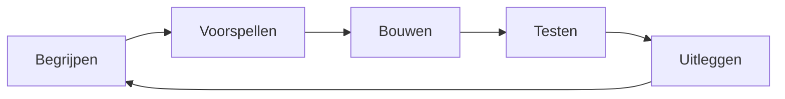

# Leerpad

Een hoofdstuk afvinken is niet hetzelfde als een vaardigheid beheersen. Gebruik
per fase deze cyclus:

## Route A — Van nul naar Java developer

| Fase | Modules | Bewijs dat je klaar bent |
|---|---|---|
| 1. Fundament | 00–01 | Je bouwt zonder IDE-magie een CLI-programma met methoden, arrays en inputvalidatie. |
| 2. Modelleren | 02–04 | Je modelleert een domein met invarianten, records, interfaces en passende collecties. |
| 3. Dataflow | 05–07 | Je verwerkt bestanden met streams zonder resources, fouten of encodings te negeren. |
| 4. Betrouwbaarheid | 12–14 | Je bouwt, test en logt een JDBC-applicatie reproduceerbaar. |
| 5. Parallel werk | 08 | Je herkent races, gebruikt executors en kunt cancellation correct doorgeven. |
| 6. Onder de motorkap | 09–10 | Je verklaart bytecode, classloading, heapgedrag en modulegrenzen. |
| 7. Ontwerp en breedte | 11, 15–16, 19 | Je ontwerpt een veilige, evolueerbare Java-API en herkent de overige Java SE-domeinen. |
| 8. Expert | 17–18 | Je diagnosticeert met metingen en verdedigt technische keuzes met bewijs. |

### Aanbevolen ritme

- Vier sessies per week van 45–90 minuten.
- Eén conceptdag, twee codedagen en één reflectie-/reviewdag.
- Om de twee weken een klein programma vanaf een leeg project.
- Na iedere module: drie bugs reproduceren die in het hoofdstuk worden genoemd.

## Route B — Versneld voor ervaren programmeurs

Lees eerst [Oriëntatie](./docs/00-orientatie/README.md) en scan daarna deze
Java-specifieke verschillen:

1. primitives versus references en parameterdoorgifte;
2. nominal typing, erasure en invariant generics;
3. checked exceptions en try-with-resources;
4. `equals`/`hashCode` en collection-contracten;
5. stream-luiheid en side effects;
6. Java Memory Model, `volatile` en interruption;
7. classloading, modules en sterke encapsulatie;
8. HotSpot/JIT-warm-up en benchmarkvalkuilen;
9. records, sealed types, patterns en virtual threads;
10. binaire, bron- en gedragscompatibiliteit.

Ga vervolgens rechtstreeks naar de kennisscan hieronder.

## Kennisscan

Geef voor iedere uitspraak een uitleg en een minimaal voorbeeld:

- [ ] Java is altijd pass-by-value, ook voor objectreferenties.
- [ ] `==`, `equals` en `compareTo` beantwoorden verschillende vragen.
- [ ] Een `HashMap` kan falen als een key na invoegen logisch verandert.
- [ ] `Stream` is geen datastructuur en kan meestal maar één keer worden verbruikt.
- [ ] `volatile` maakt een samengestelde bewerking niet atomair.
- [ ] Thread-safe betekent niet automatisch dat een reeks bewerkingen atomair is.
- [ ] Een virtual thread maakt blocking goedkoop, maar CPU-werk niet sneller.
- [ ] Een object kan onbereikbaar zijn terwijl een methode nog niet is afgelopen.
- [ ] Meer heap kan langere GC-pauzes of tragere detectie van lekken geven.
- [ ] Microbenchmarks zonder warm-up meten vaak compiler- en startupeffecten.
- [ ] Een exported module package is niet hetzelfde als een open package.
- [ ] Een semantisch compatibele update kan nog steeds performancegedrag wijzigen.

Kun je minder dan negen punten overtuigend uitleggen? Lees de gekoppelde modules
in plaats van alleen de expertsectie.

## Projectladder

| Niveau | Project | Verplichte concepten |
|---|---|---|
| Basis | Taakbeheer-CLI | types, methoden, exceptions, bestanden |
| Junior | Bibliotheekcatalogus | OOP, generics, collecties, streams, tests |
| Medior | Concurrente URL-inspecteur | HTTP Client, virtual threads, timeouts, logging |
| Senior | Transactionele boekhouding | JDBC, invarianten, transacties, architectuur |
| Expert | JVM-diagnoselab | JFR, heap dump, JMH, contention, rapportage |

Volledige opdrachten staan in [Praktijk](./docs/18-praktijk/README.md).
