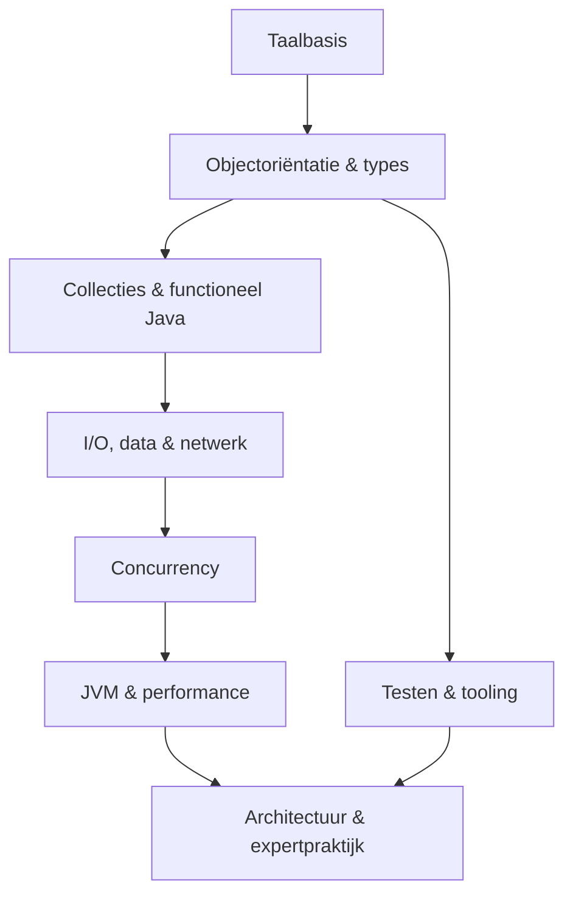

# Java Handboek

> Een complete, visuele route door modern Java: van je eerste variabele tot
> de Java Memory Model, garbage collectors, profiling en architectuur.

Dit repository is tegelijk een **leerpad**, **naslagwerk** en **checklist**.
Het legt niet alleen uit *wat* Java-syntax betekent, maar ook *waarom* de
taal, de standaardbibliotheek en de JVM zich zo gedragen.

De stabiele basis is **Java 25 LTS**. Belangrijke veranderingen in Java 26
staan apart gemarkeerd, zodat previewfuncties nooit per ongeluk als stabiele
taalregels worden voorgesteld.

## Begin hier

| Als je... | Start dan bij |
|---|---|
| nog nooit hebt geprogrammeerd | [Leerpad — Fundamenten](./LEERPAD.md#route-a-van-nul-naar-java-developer) |
| al een andere taal kent | [Versnelde route](./LEERPAD.md#route-b-versneld-voor-ervaren-programmeurs) |
| één onderwerp wilt opzoeken | [Index A–Z](./INDEX-A-Z.md) |
| een technisch woord niet begrijpt | [Woordenlijst](./WOORDENLIJST.md) |
| direct de hele structuur wilt zien | [Inhoudsopgave](./INHOUDSOPGAVE.md) |
| wilt oefenen | [Praktijk en projecten](./docs/18-praktijk/README.md) |

## Het volledige landschap

| Deel | Onderwerp | Je leert onder andere |
|---:|---|---|
| 00 | [Oriëntatie](./docs/00-orientatie/README.md) | JDK, JVM, JRE, installatie, `java`, `javac`, JShell |
| 01 | [Taalbasis](./docs/01-taalbasis/README.md) | types, expressies, besturing, methoden, arrays, tekst |
| 02 | [Objectoriëntatie](./docs/02-objectorientatie/README.md) | classes, records, interfaces, polymorfisme, sealed types |
| 03 | [Typesysteem](./docs/03-typesysteem/README.md) | generics, wildcards, `Optional`, exceptions, annotaties |
| 04 | [Collecties](./docs/04-collecties/README.md) | `List`, `Set`, `Map`, queues, complexiteit, gelijkheid |
| 05 | [Functioneel Java](./docs/05-functioneel/README.md) | lambdas, method references, streams, collectors |
| 06 | [Standaardbibliotheek](./docs/06-standaardbibliotheek/README.md) | getallen, tijd, regex, i18n, random, utilities |
| 07 | [I/O en NIO](./docs/07-io-nio/README.md) | bestanden, streams, charsets, buffers, kanalen |
| 08 | [Concurrency](./docs/08-concurrency/README.md) | threads, executors, locks, futures, virtual threads |
| 09 | [JVM internals](./docs/09-jvm/README.md) | bytecode, classloading, geheugen, GC, JIT, JFR |
| 10 | [Reflectie en modules](./docs/10-reflectie-modules/README.md) | reflectie, proxies, JPMS, services, processors |
| 11 | [Netwerk en security](./docs/11-netwerk-security/README.md) | HTTP Client, sockets, TLS, crypto, veilig coderen |
| 12 | [Data en JDBC](./docs/12-data-jdbc/README.md) | SQL, transacties, pools, mapping, migraties |
| 13 | [Testen](./docs/13-testen/README.md) | testontwerp, JUnit, doubles, integratie- en propertytests |
| 14 | [Build en tooling](./docs/14-build-tooling/README.md) | Maven, Gradle, JAR, logging, analyse, CI/CD |
| 15 | [Ontwerp en architectuur](./docs/15-architectuur/README.md) | SOLID, patronen, API-design, modulariteit |
| 16 | [Modern Java](./docs/16-modern-java/README.md) | evolutie Java 8–26, previews, migratie |
| 17 | [Expertpraktijk](./docs/17-expert/README.md) | diagnose, JMH, geheugenlekken, productiechecklists |
| 18 | [Praktijk](./docs/18-praktijk/README.md) | oefeningen, projecten, interviewvragen, beheersing |

## Hoe je dit handboek gebruikt

Elke hoofdmodule heeft dezelfde leeslaag:

1. **Kernidee** — het mentale model.
2. **Syntax en API** — compacte voorbeelden.
3. **Keuzes en valkuilen** — wanneer iets wel of niet past.
4. **Checklist** — wat je werkelijk moet beheersen.
5. **Verder** — gerichte verwijzingen naar aangrenzende onderwerpen.

De code in [`examples/`](./examples/README.md) vormt een klein Maven-project
en gebruikt alleen de Java SE-API. Fragmenten in de tekst zijn bewust klein;
de voorbeelden laten zien hoe de concepten samenkomen.

> [!TIP]
> Typ voorbeelden zelf over, wijzig één aanname en voorspel eerst de uitvoer.
> Lezen geeft herkenning; voorspellen en debuggen geven begrip.

> [!IMPORTANT]
> `Preview`, `incubator` en interne JDK-API's zijn expliciet gelabeld. Gebruik
> ze niet stilzwijgend in productiecode.

## Wat valt buiten de scope?

- Spring en het Spring-ecosysteem;
- Android-specifieke API's;
- diepgaande GUI-ontwikkeling met Swing, AWT of JavaFX;
- volledige documentatie van ieder pakket en iedere methode;
- productspecifieke cloud- en application-serverconfiguratie.

De onderliggende kennis die zulke frameworks begrijpelijk maakt — HTTP,
JDBC, transacties, concurrency, modules, testen en architectuur — staat er
juist wél in.

## Kwaliteitsprincipes

- **Stabiel vóór experimenteel.**
- **Concept vóór framework.**
- **Meten vóór optimaliseren.**
- **Compositie vóór overerving**, tenzij de substitutieregel echt klopt.
- **Veilige defaults** voor resources, nullability, data en concurrency.
- **Primaire bronnen** voor taal-, JVM- en API-claims.

Zie [Versiebeleid](./VERSIES.md), [Bronnen](./BRONNEN.md) en
[Bijdragen](./CONTRIBUTING.md).
