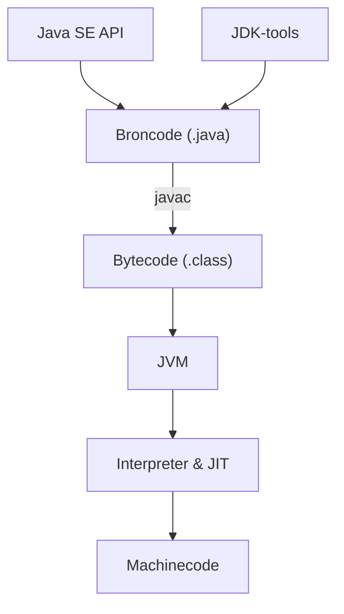

# 00 — Oriëntatie

[← Inhoudsopgave](../../INHOUDSOPGAVE.md) ·
[Volgende: Taalbasis →](../01-taalbasis/README.md)

## Mentale kaart

Java is tegelijk een taal, een platform en een ecosysteem. Houd deze lagen uit
elkaar:



| Begrip | Betekenis |
|---|---|
| Java-taal | Syntax en semantiek zoals beschreven in de JLS |
| Java SE | Gestandaardiseerd platform met kern-API's |
| JVM | Abstracte machine die classfiles laadt en uitvoert |
| JDK | JVM, Java SE-library en ontwikkeltools |
| JRE | Runtimeconcept; moderne distributies leveren meestal een JDK of custom runtime |
| HotSpot | Veelgebruikte JVM-implementatie in OpenJDK |
| OpenJDK | Open-source referentie-implementatie en ontwikkelproject |

“Write once, run anywhere” betekent dat dezelfde classfiles op compatibele
JVM's kunnen draaien. Native libraries, OS-gedrag, encodings en resources
kunnen een applicatie alsnog platformspecifiek maken.

## Een JDK kiezen

Kies voor leren en nieuwe langlevende projecten een actuele LTS-build. Dit
handboek gebruikt Java 25 LTS. Bekende distributies bouwen grotendeels
dezelfde OpenJDK-broncode, maar verschillen in support, licentie, updatebeleid
en meegeleverde componenten.

Controleer na installatie:

```bash
java --version
javac --version
```

Beide moeten naar de bedoelde majorversie verwijzen. `JAVA_HOME` wijst naar de
JDK-directory; `PATH` bepaalt welk `java`-programma de shell als eerste vindt.

> [!WARNING]
> Een IDE kan een andere JDK gebruiken dan je terminal. Controleer project-SDK,
> buildtool-toolchain én `java --version`.

## Het eerste programma

Sinds moderne Java-releases zijn compacte bronbestandsprogramma's beschikbaar,
maar een klassieke class laat de structuur expliciet zien:

```java
package nl.handboek.start;

public final class Hallo {
    private Hallo() {
    }

    public static void main(String[] args) {
        String naam = args.length == 0 ? "wereld" : args[0];
        System.out.println("Hallo, " + naam + "!");
    }
}
```

Bestandspad en package horen bij elkaar:

```text
src/main/java/nl/handboek/start/Hallo.java
```

Handmatig compileren en uitvoeren vanuit de projectroot:

```bash
javac -d out src/main/java/nl/handboek/start/Hallo.java
java -cp out nl.handboek.start.Hallo Ada
```

- `-d out` bepaalt waar classfiles komen.
- `-cp out` zet `out` op de classpath.
- De JVM krijgt de volledig gekwalificeerde classnaam, niet een bestandspad.

Voor één eenvoudig bestand kan de launcher broncode direct compileren en
uitvoeren:

```bash
java Hallo.java Ada
```

## Compile-time versus runtime

| Moment | Voorbeelden van fouten |
|---|---|
| Parse/compile-time | ongeldige syntax, onbekende variabele, verkeerd type |
| Link/load-time | ontbrekende class, incompatibele classfile, modulefout |
| Runtime | delen door nul, `NullPointerException`, netwerk-timeout |
| Logische fout | programma draait, maar berekent het verkeerde resultaat |

De compiler bewijst niet dat je programma correct is. Hij bewijst een reeks
taal- en typeregels. Tests, contracts, reviews en observability behandelen
andere foutklassen.

## De belangrijkste JDK-tools

| Tool | Doel | Voorbeeld |
|---|---|---|
| `java` | applicatie starten | `java -jar app.jar` |
| `javac` | broncode compileren | `javac --release 25 App.java` |
| `jar` | JAR-archieven maken/lezen | `jar --create --file app.jar -C out .` |
| `javap` | classfile/bytecode inspecteren | `javap -c -p App.class` |
| `javadoc` | API-documentatie genereren | `javadoc -d docs src/...` |
| `jshell` | interactief experimenteren | `jshell` |
| `jdeps` | dependencies analyseren | `jdeps app.jar` |
| `jlink` | custom runtime-image bouwen | `jlink --add-modules ...` |
| `jpackage` | native applicatiepakket maken | platformspecifieke installer |
| `jcmd` | draaiende JVM diagnosticeren | `jcmd <pid> help` |
| `jfr` | Flight Recorder-bestanden beheren | `jfr summary opname.jfr` |

Gebruik JShell voor kleine hypotheses:

```text
jshell> int som = java.util.stream.IntStream.rangeClosed(1, 10).sum()
som ==> 55
```

Gebruik het niet als vervanging voor reproduceerbare voorbeelden en tests.

## Packages, imports en classpath

Een package:

- geeft een type een unieke, volledig gekwalificeerde naam;
- vormt een access-grens voor package-private leden;
- organiseert API's;
- is **geen** hiërarchische toegangsmachtiging: `a.b` is niet “binnen” `a`.

`import` maakt een naam korter in broncode. Het downloadt niets en laadt geen
class. `java.lang` wordt impliciet geïmporteerd; subpackages niet.

De classpath is een lijst van directories en JAR's waarin de runtime unnamed
module-classes zoekt. Het module path is het JPMS-equivalent voor benoemde
modules. Buildtools beheren beide doorgaans voor je.

## Projectlayout

De conventionele Maven/Gradle-layout:

```text
project/
├── pom.xml of build.gradle.kts
└── src/
    ├── main/
    │   ├── java/
    │   └── resources/
    └── test/
        ├── java/
        └── resources/
```

Broncode, gegenereerde output en configuratie horen niet door elkaar.
Commit geen `.class`-bestanden of IDE-caches.

## Exitcodes, argumenten en omgeving

`main(String[] args)` krijgt alleen argumenten ná de class/JAR:

```bash
java -Dapp.mode=dev -jar app.jar --port 8080
```

- `-Dapp.mode=dev` is een JVM system property.
- `--port` en `8080` zijn applicatieargumenten.
- Environment variables komen via `System.getenv`.
- Een proces retourneert conventioneel `0` bij succes en niet-nul bij fout.

Behandel alle externe configuratie als onbetrouwbare invoer: parse, valideer en
geef begrijpelijke foutmeldingen.

## Checklist

- [ ] Ik kan JDK, JVM, Java SE, OpenJDK en HotSpot onderscheiden.
- [ ] Ik kan een programma zonder IDE compileren en starten.
- [ ] Ik begrijp package, import, classpath en module path op hoofdlijnen.
- [ ] Ik kan compile-time-, runtime- en logische fouten onderscheiden.
- [ ] Ik weet wanneer ik `java`, `javac`, `jar`, `javap` en JShell gebruik.
- [ ] Ik kan verklaren welke Java-versie terminal, IDE en build gebruiken.

## Verder

- [Taalbasis](../01-taalbasis/README.md)
- [Build en tooling](../14-build-tooling/README.md)
- [JVM internals](../09-jvm/README.md)
- [Reflectie en modules](../10-reflectie-modules/README.md)
