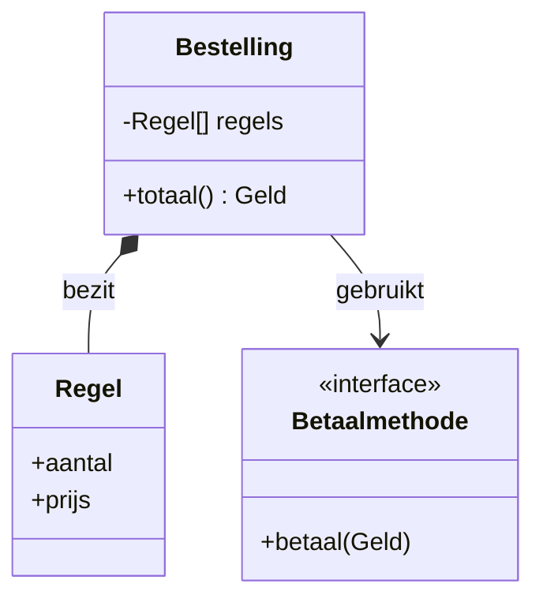

# 02 — Objectoriëntatie

[← Taalbasis](../01-taalbasis/README.md) ·
[Inhoudsopgave](../../INHOUDSOPGAVE.md) ·
[Typesysteem →](../03-typesysteem/README.md)

## Objecten als geldige toestanden

Een class is meer dan data plus methoden: ze bewaakt welke toestanden geldig
zijn en welke veranderingen toegestaan zijn.

```java
public final class Bankrekening {
    private final String iban;
    private long saldoInCenten;

    public Bankrekening(String iban, long beginsaldoInCenten) {
        if (iban == null || iban.isBlank()) {
            throw new IllegalArgumentException("IBAN ontbreekt");
        }
        if (beginsaldoInCenten < 0) {
            throw new IllegalArgumentException("Negatief beginsaldo");
        }
        this.iban = iban;
        this.saldoInCenten = beginsaldoInCenten;
    }

    public void stort(long bedragInCenten) {
        if (bedragInCenten <= 0) {
            throw new IllegalArgumentException("Bedrag moet positief zijn");
        }
        saldoInCenten = Math.addExact(saldoInCenten, bedragInCenten);
    }

    public long saldoInCenten() {
        return saldoInCenten;
    }
}
```

De constructor vestigt de invariant; publieke methoden behouden die.
Rechtstreekse veldtoegang zou dat contract ondermijnen.

## Initialisatievolgorde

Bij `new Subklasse()` gebeurt conceptueel:

1. geheugen met standaardwaarden;
2. argumentevaluatie;
3. superclassconstructor (uiteindelijk `Object`);
4. instance-fieldinitializers en initializerblokken van de class;
5. constructorbody;
6. terugkeer van de referentie.

Roep vanuit constructors geen overridable methoden aan: de subklasse kan dan
worden uitgevoerd vóór haar eigen initialisatie klaar is.

Statische initialisatie gebeurt bij class-initialization, één keer per
classloader. Complex werk daar kan startup, testisolatie en foutafhandeling
problematisch maken.

## Encapsulatie en toegang

| Modifier | Dezelfde class | Zelfde package | Subklasse elders | Overal |
|---|:---:|:---:|:---:|:---:|
| `private` | ✓ |  |  |  |
| package-private | ✓ | ✓ |  |  |
| `protected` | ✓ | ✓ | ✓* |  |
| `public` | ✓ | ✓ | ✓ | ✓ |

\* Buiten het package via de geërfde subklassecontext, niet als algemene
packagevervanger.

Geef niet automatisch getters en setters voor ieder veld. Publiceer gedrag en
stabiele informatie. Retourneer defensieve kopieën of immutable views wanneer
interne collecties niet mogen lekken.

## Compositie, overerving en substitutie



- **Compositie**: object bevat of gebruikt andere objecten.
- **Overerving**: subtype belooft overal inzetbaar te zijn waar supertype past.
- **Delegatie**: object stuurt gedrag door naar een medewerkerobject.

Overerving is correct als de Liskov-substitutieregel geldt:

- precondities worden niet strenger;
- postcondities worden niet zwakker;
- invarianten blijven gelden;
- verwacht observeerbaar gedrag blijft compatibel.

Gebruik `final` op classes/methoden wanneer uitbreiding geen ontworpen contract
is. Een abstracte class kan state en gedeeltelijke implementatie delen; een
interface definieert vooral een rol/capability en ondersteunt meervoudige
implementatie.

## Interfaces

```java
public interface Prijsbaar {
    java.math.BigDecimal prijs();

    default boolean isGratis() {
        return prijs().signum() == 0;
    }
}
```

Interfaces kunnen abstracte, `default`, `static` en private methoden bevatten.
Velden zijn impliciet `public static final`. Defaultmethoden ondersteunen
API-evolutie, maar lossen geen conflicterend domeinmodel op.

Bij een defaultmethodconflict moet de implementerende class expliciet kiezen.
Een concrete classmethode heeft voorrang op een interface-default.

## Polymorfisme

```java
Prijsbaar item = new Boek("Effective Java", new BigDecimal("45.00"));
System.out.println(item.prijs());
```

- Compile-time-type (`Prijsbaar`) bepaalt welke leden aanroepbaar zijn.
- Runtime-type (`Boek`) bepaalt welke overridden instance-methode draait.
- Velden en `static` methoden zijn niet polymorf; ze worden verborgen, niet
  overridden.

Gebruik `@Override`: de compiler bewaakt dan dat je werkelijk override.

## `Object`-contracten

### `equals`

Moet reflexief, symmetrisch, transitief, consistent en `false` voor `null`
zijn. Kies bewust identiteit of waardegelijkheid.

### `hashCode`

Als `a.equals(b)`, dan moet `a.hashCode() == b.hashCode()`. Het omgekeerde
hoeft niet. Velden die equality bepalen mogen niet veranderen terwijl het
object key in een hashcollectie is.

### `toString`

Maak diagnostisch nuttig, maar zet geen secrets, tokens of gevoelige
persoonsgegevens in logs.

### `clone` en finalization

Geef voorkeur aan copy constructors/factories boven `Cloneable`. Finalization
is deprecated for removal; gebruik try-with-resources, `AutoCloseable` en
eventueel `Cleaner` alleen als vangnet.

## Records

Een record is een compacte, nominale datadrager:

```java
public record Geld(java.math.BigDecimal bedrag, java.util.Currency valuta) {
    public Geld {
        java.util.Objects.requireNonNull(bedrag);
        java.util.Objects.requireNonNull(valuta);
        if (bedrag.scale() > valuta.getDefaultFractionDigits()) {
            throw new IllegalArgumentException("Te veel decimalen");
        }
    }

    public Geld plus(Geld ander) {
        if (!valuta.equals(ander.valuta)) {
            throw new IllegalArgumentException("Andere valuta");
        }
        return new Geld(bedrag.add(ander.bedrag), valuta);
    }
}
```

Records leveren component-accessors, constructor, `equals`, `hashCode` en
`toString`. Ze zijn impliciet final. De componentreferenties zijn final, maar
hun objecten niet automatisch diep immutable.

Gebruik een record voor transparante data met waardesemantiek; niet alleen om
boilerplate te vermijden bij een entiteit met veranderlijke identiteit.

## Enums

```java
enum Status {
    NIEUW(false),
    BETAALD(true),
    GEANNULEERD(true);

    private final boolean definitief;

    Status(boolean definitief) {
        this.definitief = definitief;
    }

    boolean isDefinitief() {
        return definitief;
    }
}
```

Een enumconstante is één instantie. Vergelijk enums met `==`. Gebruik
`EnumSet` en `EnumMap` voor efficiënte enumcollecties. Persist de naam alleen
als je een hernoemingsstrategie hebt; persist nooit `ordinal()`.

## Sealed types en patterns

```java
sealed interface Resultaat<T> permits Succes, Mislukking {}

record Succes<T>(T waarde) implements Resultaat<T> {}
record Mislukking<T>(String melding) implements Resultaat<T> {}

static String beschrijf(Resultaat<?> resultaat) {
    return switch (resultaat) {
        case Succes<?> s -> "Gelukt: " + s.waarde();
        case Mislukking<?> m -> "Fout: " + m.melding();
    };
}
```

Directe subtypes van een sealed type zijn `final`, `sealed` of `non-sealed`.
Een gesloten hiërarchie maakt exhaustive pattern matching mogelijk en modelleert
een algebraïsche som: een waarde is exact één van bekende varianten.

Pattern variables bestaan alleen waar de compiler de match bewezen heeft:

```java
if (vorm instanceof Cirkel cirkel && cirkel.straal() > 0) {
    teken(cirkel);
}
```

## Nested types

| Soort | Heeft impliciete outer-instance? | Typisch gebruik |
|---|---:|---|
| static nested class | nee | helper/type logisch groeperen |
| inner class | ja | gedrag gekoppeld aan één outer-object |
| local class | afhankelijk van context | lokaal complex type |
| anonymous class | afhankelijk van context | eenmalige implementatie |

Een niet-statische inner class kan de outer-instance onbedoeld vasthouden.
Voor stateless callbacks is een lambda vaak compacter, maar lambdas hebben
andere identiteit- en `this`-semantiek.

## API-ontwerp: constructors en factories

Static factory:

```java
public static Geld euro(String bedrag) {
    return new Geld(new BigDecimal(bedrag), Currency.getInstance("EUR"));
}
```

Voordelen: betekenisvolle naam, caching mogelijk, subtype teruggeven,
validatie centraliseren. Nadelen: minder direct vindbaar en geen nieuw
subclassconstructorcontract.

Gebruik een builder als veel optionele parameters bestaan of stapsgewijze
validatie waarde toevoegt. Gebruik geen builder voor een record met twee
eenduidige componenten.

## Veelgemaakte fouten

- Dataclasses met publieke setters en zonder invarianten.
- Overerving kiezen voor codehergebruik zonder echte substitutie.
- Een mutable object als `HashMap`-key gebruiken.
- `equals` in een subklasse uitbreiden en symmetrie verbreken.
- Records als excuus voor mutable componenten.
- Constructorparameters negeren en een halfgeldig object maken.
- `this` laten ontsnappen tijdens constructie.
- Domeintypes vervangen door losse `String`- en `long`-waarden.

## Checklist

- [ ] Mijn constructors vestigen geldige objecten.
- [ ] Ik kan compositie, delegatie en overerving onderbouwen.
- [ ] Ik begrijp compile-time-type versus runtime-dispatch.
- [ ] Ik implementeer `equals` en `hashCode` als één contract.
- [ ] Ik kies bewust tussen class, record, enum, interface en sealed type.
- [ ] Ik lek geen mutable interne state.
- [ ] Ik herken initialisatie- en constructorvalkuilen.

## Verder

- [Typesysteem](../03-typesysteem/README.md)
- [Collecties](../04-collecties/README.md)
- [Ontwerp en architectuur](../15-architectuur/README.md)
