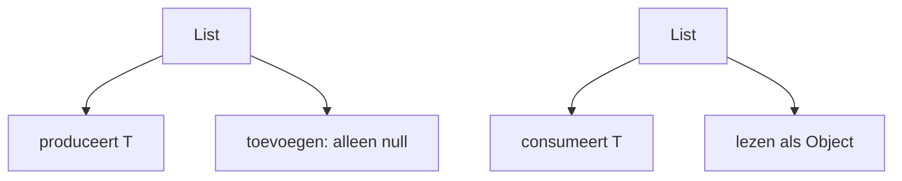
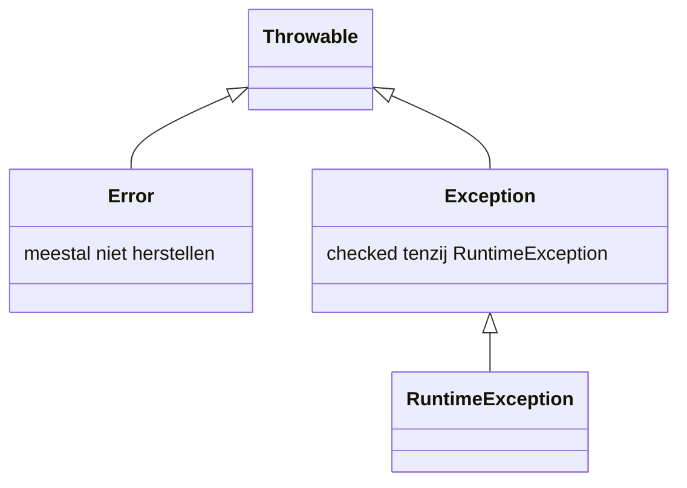

# 03 — Typesysteem, generics en fouten

[← Objectoriëntatie](../02-objectorientatie/README.md) ·
[Inhoudsopgave](../../INHOUDSOPGAVE.md) ·
[Collecties →](../04-collecties/README.md)

## Nominale en statische typering

Java is overwegend statisch en nominaal getypeerd:

- de compiler kent een type voor iedere expressie;
- compatibiliteit volgt gedeclareerde relaties, niet alleen dezelfde vorm;
- runtime-objects behouden classinformatie, maar generieke argumenten zijn
  meestal door erasure niet volledig beschikbaar.

```java
CharSequence tekst = "Java";
Object object = tekst;
```

De compile-time-view wordt smaller of breder via assignment, casts en pattern
matching. Een cast verandert het object niet; hij vraagt een runtimecontrole:

```java
if (object instanceof String s) {
    System.out.println(s.toUpperCase());
}
```

Een verkeerde reference cast geeft `ClassCastException`.

## Generics

Generics drukken relaties tussen types uit:

```java
public final class Doos<T> {
    private final T waarde;

    public Doos(T waarde) {
        this.waarde = java.util.Objects.requireNonNull(waarde);
    }

    public T waarde() {
        return waarde;
    }
}
```

Gebruik:

```java
Doos<String> doos = new Doos<>("tekst");
String tekst = doos.waarde(); // geen cast nodig
```

Generics accepteren geen primitives als typeargument. Gebruik wrappers of
primitive-specialized API's zoals `IntStream`.

### Invariantie

`List<Integer>` is **geen** subtype van `List<Number>`. Anders zou dit
onveilig zijn:

```java
// Stel dat dit mocht:
List<Number> nummers = eenIntegerLijst;
nummers.add(3.14); // Integer-lijst bevat ineens Double
```

Arrays zijn wel covariant en betalen daarvoor met runtime-storechecks.

### Bounded typeparameters

```java
static <T extends Comparable<? super T>> T maximum(List<? extends T> waarden) {
    if (waarden.isEmpty()) {
        throw new IllegalArgumentException("Lege lijst");
    }
    T max = waarden.getFirst();
    for (T waarde : waarden) {
        if (waarde.compareTo(max) > 0) {
            max = waarde;
        }
    }
    return max;
}
```

Meerdere bounds: `<T extends Basisklasse & InterfaceA & InterfaceB>`.
Een eventuele class moet als eerste staan.

## Wildcards en PECS



**Producer Extends, Consumer Super**:

```java
static <T> void kopieer(
        List<? extends T> bron,
        List<? super T> doel) {
    for (T element : bron) {
        doel.add(element);
    }
}
```

- `? extends T`: veilig lezen als `T`, niet veilig toevoegen.
- `? super T`: veilig een `T` toevoegen, lezen alleen als `Object`.
- `List<?>`: lijst van een onbekend maar vast type; veiliger dan raw `List`.

Gebruik een typeparameter als dezelfde onbekende typekeuze op meerdere plekken
gekoppeld moet blijven. Gebruik een wildcard als die relatie niet nodig is.

## Type-erasure

De meeste generieke typeargumenten bestaan niet als volledige runtime-info:

```java
// niet toegestaan:
// if (x instanceof List<String>) {}
// T waarde = new T();
// T[] array = new T[10];
```

De compiler:

- controleert generieke regels;
- voegt waar nodig casts toe;
- gebruikt erased bounds;
- kan bridge methods genereren voor polymorfisme.

Gevolgen:

- `List<String>` en `List<Integer>` hebben dezelfde runtime-class;
- varargs met niet-reifiable types kunnen heap pollution veroorzaken;
- raw types omzeilen controle en veroorzaken uitgestelde runtimefouten.

Gebruik `@SafeVarargs` alleen wanneer je handmatig hebt bewezen dat de body
geen onveilige toegang of opslag uitvoert.

## Type-inferentie

De compiler gebruikt target typing:

```java
List<String> namen = List.of();
var mapping = java.util.Map.of("a", 1);
java.util.function.Predicate<String> lang = s -> s.length() > 10;
```

Wanneer overloads en lambdas ambigu worden, geef een expliciet type of splits
de expressie. Slimme inferentie is geen doel op zichzelf.

## Nullability en `Optional`

Java's basistypesysteem markeert nullability niet universeel. Maak het contract
dus expliciet door ontwerp, documentatie, annotaties en validatie.

```java
public Optional<Gebruiker> zoekOpId(GebruikerId id) {
    return Optional.ofNullable(index.get(id));
}
```

Goed gebruik van `Optional`:

- returntype wanneer “geen resultaat” normaal en betekenisvol is;
- transformeren met `map`, `flatMap`, `filter`, `or`;
- grens expliciet afhandelen met `orElseThrow` of een default.

Meestal niet:

- als elk veld, elke parameter of collection-element;
- `Optional` zelf op `null` zetten;
- `isPresent()` gevolgd door `get()` als een combinator duidelijker is;
- `orElse(dureBerekening())` wanneer lui `orElseGet` bedoeld is.

Collections zijn bij afwezigheid vaak beter leeg dan `null`.

## Exceptions als foutmodel



### Checked versus unchecked

- **Checked exception**: caller moet catchen of declareren. Past bij een
  herstelbare externe mislukking die callers zinvol moeten overwegen.
- **RuntimeException**: contractschending, programmeerfout of fout die op deze
  laag niet zinvol verplicht kan worden afgehandeld.
- **Error**: ernstige runtime-/linkageproblemen; doorgaans niet vangen.

Dit is een API-ontwerpkeuze, niet een oordeel dat één categorie “erger” is.

### Gooien en vertalen

```java
try {
    return repository.laad(id);
} catch (java.sql.SQLException e) {
    throw new OpslagException("Kon bestelling " + id + " niet laden", e);
}
```

Bewaar de cause. Voeg context toe, maar log niet op iedere laag dezelfde fout.
Catch zo specifiek mogelijk. Een lege catch verbergt bewijs.

### Try-with-resources

```java
try (var reader = Files.newBufferedReader(pad, StandardCharsets.UTF_8)) {
    return reader.lines().toList();
}
```

Resources sluiten in omgekeerde declaratierichting. Als body én `close()`
falen, blijft de body-exception primair en staat de close-fout als suppressed
exception erbij.

Een `AutoCloseable`-contract moet idempotentie en exceptiongedrag duidelijk
documenteren.

### InterruptedException

Een interrupt is een samenwerkingssignaal voor cancellation, geen gewone fout:

```java
try {
    queue.put(taak);
} catch (InterruptedException e) {
    Thread.currentThread().interrupt();
    throw new TaakGeannuleerdException("Onderbroken", e);
}
```

Geef hem door of herstel de interruptstatus als je hem omzet.

## Eigen exceptions

Maak een kleine hiërarchie op basis van wat de caller kan doen, niet één class
per foutzin:

```java
sealed class DomeinException extends RuntimeException
        permits OngeldigeBestelling, OnvoldoendeVoorraad {
    DomeinException(String message) {
        super(message);
    }
}
```

Let op: exceptionobjecten en stack traces zijn relatief duur. Gebruik ze niet
als normaal succes-/zoekresultaat in een hot loop.

## Annotaties

Een annotatie voegt gestructureerde metadata toe:

```java
@Target(ElementType.METHOD)
@Retention(RetentionPolicy.RUNTIME)
public @interface Audit {
    String actie();
    Niveau niveau() default Niveau.NORMAAL;
}
```

Belangrijke meta-annotaties:

| Annotatie | Betekenis |
|---|---|
| `@Target` | toegestane programmadelen |
| `@Retention` | SOURCE, CLASS of RUNTIME |
| `@Documented` | opnemen in Javadoc |
| `@Inherited` | class-annotatie erven naar subclasses |
| `@Repeatable` | meerdere instanties toestaan |

Type-use-annotaties kunnen ieder typegebruik markeren, bijvoorbeeld voor
nullabilitytools. De betekenis komt van de tool/library; Java zelf valideert
een willekeurige `@NonNull` niet automatisch.

## Veelgemaakte fouten

- Raw types gebruiken om een genericsfout “op te lossen”.
- `List<Object>` en `List<?>` verwarren.
- Overal `? extends` zetten en vervolgens niets kunnen toevoegen.
- Blind casten na een compilerwarning.
- `Optional.get()` als standaardtoegang.
- `null` als element, returnwaarde én foutsignaal tegelijk gebruiken.
- `Exception` vangen, loggen en doorgaan met corrupte state.
- Cause of interrupt verliezen.
- Checked exceptions lekken over een abstractiegrens waar ze geen betekenis hebben.

## Checklist

- [ ] Ik begrijp invariantie, bounds, wildcards en PECS.
- [ ] Ik kan uitleggen wat type-erasure wel en niet verwijdert.
- [ ] Ik vermijd raw types en ongecontroleerde casts.
- [ ] Ik modelleer afwezigheid bewust met waarde, lege collectie of `Optional`.
- [ ] Ik kies checked/unchecked op caller-contract.
- [ ] Ik beheer resources en suppressed exceptions correct.
- [ ] Ik behoud exception cause en interruptstatus.
- [ ] Ik ken retention en target van annotaties.

## Verder

- [Collecties](../04-collecties/README.md)
- [Functioneel Java](../05-functioneel/README.md)
- [I/O en NIO](../07-io-nio/README.md)
