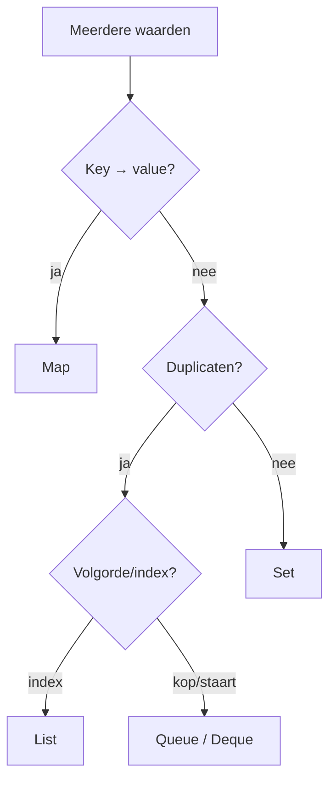

# 04 — Collecties en datastructuren

[← Typesysteem](../03-typesysteem/README.md) ·
[Inhoudsopgave](../../INHOUDSOPGAVE.md) ·
[Functioneel Java →](../05-functioneel/README.md)

## Kies op contract en toegangspatroon



Declareer meestal het interface:

```java
List<String> namen = new ArrayList<>();
Map<GebruikerId, Gebruiker> index = new HashMap<>();
```

De concrete implementatie kies je op ordening, mutatie, concurrency,
geheugenverbruik en dominante operaties.

## De hiërarchie

`Map` is bewust geen subtype van `Collection`.

| Interface | Kerncontract |
|---|---|
| `Iterable<E>` | levert een `Iterator<E>` |
| `Collection<E>` | groep elementen |
| `List<E>` | geordend, index, duplicaten |
| `Set<E>` | geen gelijke duplicaten |
| `Queue<E>` | verwerking via kop |
| `Deque<E>` | toevoegen/verwijderen aan beide kanten |
| `Map<K,V>` | unieke keys naar values |

### Dubbele methoden bij queues

| Operatie | Exception bij mislukking | Speciale waarde |
|---|---|---|
| toevoegen | `add` | `offer` |
| kop lezen/verwijderen | `remove` | `poll` |
| kop lezen/behouden | `element` | `peek` |

Gebruik `offer`/`poll` bij begrensde queues en normale leegte.

## Implementaties kiezen

| Type | Eigenschap | Typische keuze |
|---|---|---|
| `ArrayList` | snelle index/toevoeging achteraan | standaard `List` |
| `LinkedList` | dubbelgelinkte nodes, ook `Deque` | zelden voor indexwerk |
| `ArrayDeque` | efficiënte stack/queue | standaard `Deque` |
| `HashSet` | hashing, geen gegarandeerde volgorde | snelle membership |
| `LinkedHashSet` | insertion order | dedupliceren met volgorde |
| `TreeSet` | gesorteerd, boom | range/ordered queries |
| `HashMap` | hashing, geen gegarandeerde volgorde | standaard `Map` |
| `LinkedHashMap` | insertion/access order | stabiele iteratie/LRU-basis |
| `TreeMap` | gesorteerde keys | navigatie/ranges |
| `EnumSet`/`EnumMap` | compacte enumrepresentatie | enumkeys/-waarden |
| `PriorityQueue` | kleinste/hoogste element eerst | scheduler/top-k |

`Stack` en `Vector` zijn legacy; gebruik meestal `ArrayDeque` en moderne
concurrencycollecties.

## Complexiteit als richting, niet als stopwatch

Gemiddelde/amortized verwachtingen:

| Bewerking | `ArrayList` | `HashMap` | `TreeMap` | `ArrayDeque` |
|---|---:|---:|---:|---:|
| index lezen | O(1) | — | — | — |
| zoeken | O(n) | O(1) key | O(log n) key | O(n) |
| achteraan toevoegen | O(1) amortized | O(1) | O(log n) | O(1) amortized |
| midden invoegen | O(n) | — | — | — |
| eerste/laatste | O(1) | — | O(log n) | O(1) |

Constante factoren, cachelocaliteit, allocaties en keykwaliteit tellen. Meet een
realistische workload vóór een exotische keuze.

## Gelijkheid en hashing

Een `HashMap`:

1. berekent de hash;
2. kiest een bucket;
3. gebruikt `equals` om de exacte key te vinden.

```java
record GebruikerId(long waarde) {}

Map<GebruikerId, String> namen = new HashMap<>();
namen.put(new GebruikerId(7), "Ada");
assert namen.get(new GebruikerId(7)).equals("Ada");
```

Keys moeten gedurende hun verblijf in de map stabiele equality/hashcode
hebben. Een slechte hashdistributie schaadt performance, maar correcte
`equals` blijft noodzakelijk.

`TreeMap`/`TreeSet` bepalen identiteit via comparator/`compareTo`, niet via
`equals`. Zorg dat ordening consistent is met equality, tenzij je het afwijkende
gedrag bewust accepteert.

## Ordening

Natuurlijke ordening:

```java
record Persoon(String achternaam, String voornaam)
        implements Comparable<Persoon> {
    @Override
    public int compareTo(Persoon ander) {
        return Comparator.comparing(Persoon::achternaam)
                .thenComparing(Persoon::voornaam)
                .compare(this, ander);
    }
}
```

Alternatieve ordening:

```java
Comparator<Persoon> opVoornaam =
        Comparator.comparing(Persoon::voornaam)
                .thenComparing(Persoon::achternaam)
                .thenComparingInt(System::identityHashCode);
```

De laatste tie-breaker hierboven is alleen illustratief en niet stabiel over
processen; gebruik in echte data een stabiele unieke key. Vermijd verschil
berekenen (`a - b`) als comparator: dat kan overflowen. Gebruik
`Integer.compare`, `Long.compare` of comparator-combinators.

## Immutable, unmodifiable en kopieën

```java
List<String> vast = List.of("a", "b");
List<String> snapshot = List.copyOf(mutableBron);
List<String> view = Collections.unmodifiableList(mutableBron);
```

| Vorm | Structurele mutatie via resultaat | Verandert mee met bron? |
|---|---:|---:|
| `List.of` | nee | geen bron |
| `List.copyOf` | nee | nee |
| `unmodifiableList` | nee | ja |
| `subList` | via view mogelijk | ja |

“Immutable collection” zegt niets over de mutability van de elementen.

Factorycollections (`List.of`, `Set.of`, `Map.of`) weigeren `null`.
`Set.of` en `Map.of` weigeren duplicaten.

## Views en iterators

`keySet`, `values`, `entrySet` en `subList` zijn meestal backed views.
Wijzigingen kunnen beide kanten zichtbaar zijn.

Een enhanced for-loop gebruikt een iterator. Structurele wijziging buiten die
iterator kan best-effort `ConcurrentModificationException` geven:

```java
for (Iterator<String> it = namen.iterator(); it.hasNext();) {
    if (it.next().isBlank()) {
        it.remove(); // correcte verwijderroute
    }
}
```

Fail-fast is een bugdetectiemechanisme, geen thread-safety-garantie.

## Handige Map-operaties

```java
frequenties.merge(woord, 1, Integer::sum);
index.computeIfAbsent(groep, g -> new ArrayList<>()).add(item);
gebruiker = cache.getOrDefault(id, ONBEKEND);
```

De mappingfunctie van `computeIfAbsent` hoort kort te zijn en mag niet
onvoorspelbaar dezelfde map muteren. Bij concurrent maps gelden specifiekere
atomiciteitscontracten.

## Concurrent collections

| Type | Gebruik |
|---|---|
| `ConcurrentHashMap` | schaalbare gedeelde key-value state |
| `CopyOnWriteArrayList` | veel lezen, zeer weinig schrijven, snapshots |
| `BlockingQueue` | producer-consumer met backpressure |
| `ConcurrentLinkedQueue` | niet-blockerende FIFO |
| `ConcurrentSkipListMap` | concurrerend én gesorteerd |

Een thread-safe collection maakt een samengestelde workflow niet automatisch
atomair. Gebruik aangeboden atomic methods (`compute`, `putIfAbsent`) of een
grotere synchronisatiegrens.

## Sequenced collections

Sinds Java 21 geven `SequencedCollection`, `SequencedSet` en `SequencedMap`
uniforme toegang tot eerste, laatste en omgekeerde views. Voorbeelden:
`getFirst`, `getLast`, `reversed`, `firstEntry`.

Vraag nog steeds of volgorde onderdeel van je domeincontract is. Vertrouwen op
toevallige iteratievolgorde van een `HashMap` blijft fout.

## Veelgemaakte fouten

- `LinkedList` kiezen omdat invoegen theoretisch O(1) is, maar de node eerst
  via O(n) zoeken en cachelocaliteit negeren.
- `contains` in een nested loop gebruiken waar een vooraf gebouwde `Set` past.
- Mutable keys in hashcollecties.
- Een `subList` lang vasthouden en daarmee een grote backing list behouden.
- `Collections.unmodifiableList` verwarren met een snapshot.
- `null` gebruiken waar afwezigheid of een lege collectie duidelijker is.
- Tijdens iteratie via de collection zelf verwijderen.

## Checklist

- [ ] Ik kies interface en implementatie op contract/toegangspatroon.
- [ ] Ik kan de hoofdcomplexiteiten verklaren.
- [ ] Mijn equality-, hash- en comparatorcontracten zijn consistent.
- [ ] Ik onderscheid immutable waarde, unmodifiable view en kopie.
- [ ] Ik weet welke API's backed views teruggeven.
- [ ] Ik gebruik `Deque` voor stack/queue en map-combinators voor atomiciteit.
- [ ] Ik kies bewust een concurrencycollectie.

## Verder

- [Functioneel Java](../05-functioneel/README.md)
- [Concurrency](../08-concurrency/README.md)
- [Objectoriëntatie](../02-objectorientatie/README.md)
