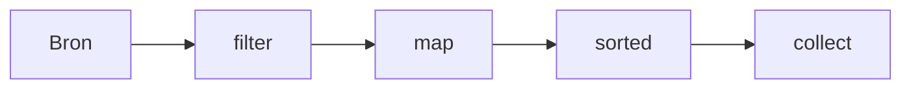

# 05 — Functioneel Java en streams

[← Collecties](../04-collecties/README.md) ·
[Inhoudsopgave](../../INHOUDSOPGAVE.md) ·
[Standaardbibliotheek →](../06-standaardbibliotheek/README.md)

## Functies als waarden

Java blijft objectgeoriënteerd, maar functionele interfaces laten gedrag als
waarde doorgeven.

```java
@FunctionalInterface
interface Omzetter<T, R> {
    R zetOm(T invoer);
}

Omzetter<String, Integer> lengte = tekst -> tekst.length();
```

Een functionele interface heeft één abstracte methode (SAM). `default`,
`static` en `Object`-methoden tellen niet als extra abstract contract.

Belangrijke interfaces:

| Interface | Vorm | Vraag |
|---|---|---|
| `Predicate<T>` | `T → boolean` | voldoet waarde? |
| `Function<T,R>` | `T → R` | transformeer |
| `UnaryOperator<T>` | `T → T` | transformeer zelfde type |
| `Consumer<T>` | `T → void` | voer effect uit |
| `Supplier<T>` | `() → T` | lever/maak waarde |
| `BiFunction<T,U,R>` | `(T,U) → R` | combineer twee waarden |

Primitive-specialisaties (`IntPredicate`, `ToLongFunction`, enz.) vermijden
boxing in intensieve code.

## Lambda, method reference en closure

```java
Predicate<String> nietLeeg = s -> !s.isBlank();
Function<String, String> normaliseer = String::strip;
Supplier<List<String>> nieuweLijst = ArrayList::new;
Consumer<String> printer = System.out::println;
```

Een lambda kan lokale variabelen capturen als die final of effectively final
zijn. De waarde wordt vastgelegd; een mutable object waarnaar ze verwijst kan
wel muteren.

`this` in een lambda verwijst naar de omliggende instance. Een anonymous class
heeft een eigen `this`. Vertrouw niet op lambda-objectidentiteit,
serialisatievorm of concrete class.

## Compositie

```java
Predicate<String> bruikbaar =
        nietLeeg.and(s -> s.length() <= 100);

Function<String, Integer> gestriptLengte =
        String::strip
                .andThen(String::length);
```

Kleine pure functies zijn eenvoudiger te testen en paralleliseren. Een pure
functie heeft voor dezelfde input hetzelfde resultaat en geen observeerbare
side effects.

## Een stream is een pipeline



```java
List<String> resultaat = personen.stream()
        .filter(Persoon::actief)
        .map(Persoon::naam)
        .map(String::strip)
        .filter(naam -> !naam.isEmpty())
        .sorted()
        .toList();
```

- bron: collection, array, generator, bestand, API;
- intermediate operations: meestal lui;
- terminal operation: start verbruik;
- stream wordt één keer verbruikt;
- elementen stromen door de pipeline; tussenresultaatcollecties zijn vaak niet
  nodig.

`Stream.toList()` levert een unmodifiable lijst. Gebruik
`collect(Collectors.toCollection(ArrayList::new))` als mutability onderdeel
van het gewenste resultaat is.

## Stateless en non-interfering

Fout:

```java
List<String> uitvoer = new ArrayList<>();
namen.parallelStream()
        .filter(this::geldig)
        .forEach(uitvoer::add); // race en verborgen side effect
```

Goed:

```java
List<String> uitvoer = namen.parallelStream()
        .filter(this::geldig)
        .toList();
```

Wijzig de streambron niet tijdens verwerking. Vermijd stateful lambdas;
collectors bestaan juist om reductie correct te modelleren.

## Kernoperaties

| Operatie | Betekenis |
|---|---|
| `filter` | behoud passende elementen |
| `map` | één element naar één resultaat |
| `flatMap` | één element naar nul/meerdere resultaten en vlakmaken |
| `distinct` | duplicaten volgens `equals` verwijderen |
| `sorted` | encounter order sorteren |
| `limit`/`skip` | deelvenster |
| `takeWhile`/`dropWhile` | prefix op geordende stream |
| `peek` | vooral diagnose, niet businessmutatie |
| `findFirst`/`findAny` | mogelijk element |
| `anyMatch`/`allMatch`/`noneMatch` | short-circuit predicate |
| `reduce` | waarden associatief combineren |
| `collect` | mutable reduction naar container |

### `map` versus `flatMap`

```java
List<String> regels = documenten.stream()
        .flatMap(document -> document.regels().stream())
        .toList();

Optional<Adres> adres = gebruikerOpt
        .flatMap(Gebruiker::hoofdAdres);
```

`map` zou hier respectievelijk `Stream<List<String>>` en
`Optional<Optional<Adres>>` opleveren.

## Reductie

```java
int totaal = aantallen.stream()
        .reduce(0, Integer::sum);
```

De identity moet neutraal zijn en de accumulator associatief voor correcte
parallelle uitvoering. Floating-pointoptelling is door afronding niet strikt
associatief; parallelle volgorde kan het laatste beetje wijzigen.

Gebruik gespecialiseerde operaties als ze intentie beter tonen:

```java
long actief = gebruikers.stream().filter(Gebruiker::actief).count();
int som = waarden.stream().mapToInt(Integer::intValue).sum();
```

## Collectors

```java
Map<Afdeling, List<Werknemer>> perAfdeling = werknemers.stream()
        .collect(Collectors.groupingBy(Werknemer::afdeling));

Map<Status, Long> aantallen = bestellingen.stream()
        .collect(Collectors.groupingBy(
                Bestelling::status,
                Collectors.counting()));

String csv = namen.stream()
        .collect(Collectors.joining(", "));
```

Andere bouwstenen: `partitioningBy`, `mapping`, `flatMapping`, `filtering`,
`reducing`, `summarizingInt`, `toMap`, `collectingAndThen`, `teeing`.

`toMap` vereist een mergefunctie als keys kunnen botsen:

```java
Map<String, Persoon> opEmail = personen.stream()
        .collect(Collectors.toMap(
                Persoon::email,
                Function.identity(),
                (eerste, tweede) -> kiesNieuwste(eerste, tweede)));
```

## Volgorde en short-circuiting

Een ordered stream bewaart encounter order waar het contract dat vereist.
`forEachOrdered` bewaart volgorde bij parallel gebruik; `forEach` hoeft dat
niet.

`limit`, `findFirst`, match-operaties en `takeWhile` kunnen vroeg stoppen.
Een oneindige stream is dus bruikbaar als een terminal operatie begrenst:

```java
List<Integer> eersteTienEven = Stream.iterate(0, n -> n + 2)
        .limit(10)
        .toList();
```

## Parallelle streams

Parallel is geen snelheidsvlag.

Geschikt wanneer:

- veel elementen;
- CPU-bound werk per element;
- goed splitsbare bron;
- stateless associatieve bewerkingen;
- voldoende vrije common-poolcapaciteit;
- gemeten winst.

Ongeschikt wanneer:

- blocking I/O;
- kleine datasets;
- side effects of strikte volgorde;
- requestservers die dezelfde common pool delen;
- latency belangrijker is dan throughput.

Gebruik virtual threads of een expliciete executor voor veel blocking I/O.
Benchmark de gehele use case, niet alleen één pipeline.

## Veelgemaakte fouten

- Een stream opslaan en tweemaal consumeren.
- `peek` gebruiken voor noodzakelijke mutaties.
- Exceptions uit lambdas verbergen in generieke wrappers.
- `parallel()` toevoegen zonder workloadmeting.
- Een complexe stream verkiezen boven een leesbare lus.
- `reduce` gebruiken om een mutable collection te vullen.
- Vergeten dat `sorted` en `distinct` stateful/buffering kunnen zijn.
- `orElse` gebruiken voor een dure fallback die altijd wordt berekend.

## Checklist

- [ ] Ik kies een passende functionele interface en primitive-specialisatie.
- [ ] Ik begrijp capture en effectief-final.
- [ ] Ik kan luiheid en short-circuiting voorspellen.
- [ ] Ik onderscheid `map`, `flatMap`, `reduce` en `collect`.
- [ ] Mijn lambdas zijn stateless en interfereren niet met de bron.
- [ ] Ik behandel duplicate keys bij `toMap`.
- [ ] Ik gebruik parallelle streams alleen na geschiktheidsanalyse en meting.

## Verder

- [Collecties](../04-collecties/README.md)
- [Concurrency](../08-concurrency/README.md)
- [I/O en NIO](../07-io-nio/README.md)
