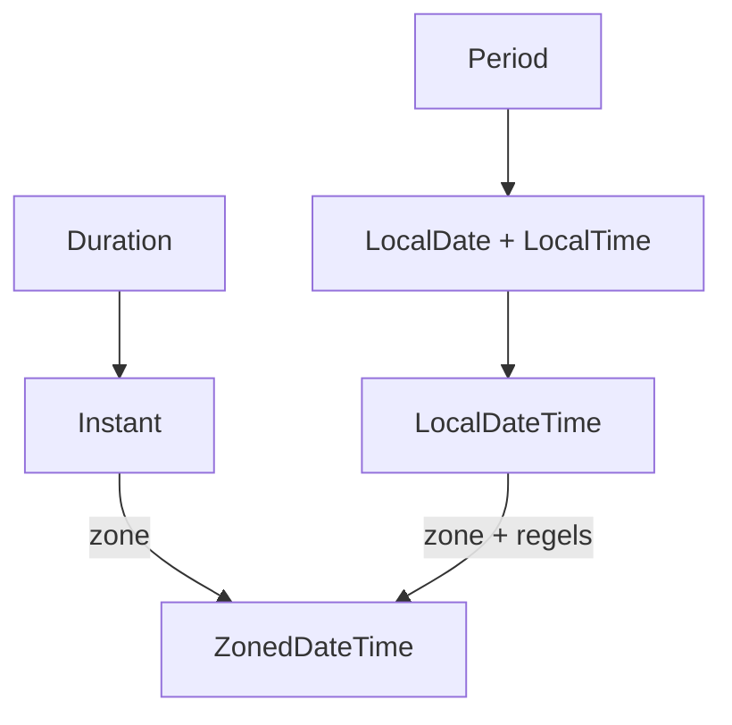

# 06 — Standaardbibliotheek

[← Functioneel Java](../05-functioneel/README.md) ·
[Inhoudsopgave](../../INHOUDSOPGAVE.md) ·
[I/O en NIO →](../07-io-nio/README.md)

De Java SE-API is groter dan één hoofdstuk. Dit is de kaart van dagelijkse
bouwelementen; de [officiële API-documentatie][api] blijft het methodecontract.

## Getallen

### `Math` en exactheid

```java
int absoluut = Math.abs(x);
double afstand = Math.hypot(dx, dy);
long veilig = Math.multiplyExact(a, b);
int begrensd = Math.clamp(waarde, minimum, maximum);
```

`StrictMath` geeft reproduceerbaardere algoritmen voor bepaalde transcendente
functies. Controleer randgevallen: `Math.abs(Integer.MIN_VALUE)` kan niet als
positieve `int` worden weergegeven.

### `BigInteger`

Arbitraire gehele precisie:

```java
BigInteger faculteit = BigInteger.ONE;
for (int i = 2; i <= 100; i++) {
    faculteit = faculteit.multiply(BigInteger.valueOf(i));
}
```

De typewaarden zijn immutable; methoden retourneren een nieuw resultaat.

### `BigDecimal`

```java
BigDecimal prijs = new BigDecimal("19.95");
BigDecimal btw = prijs.multiply(new BigDecimal("0.21"));
BigDecimal afgerond = btw.setScale(2, RoundingMode.HALF_EVEN);
```

- Maak uit een decimale `String`, niet meestal uit `double`.
- `equals` vergelijkt waarde én scale: `2.0` is niet `equals` aan `2.00`.
- `compareTo` vergelijkt numerieke waarde.
- Delen zonder exacte representatie vereist scale/`MathContext` of
  `RoundingMode`.
- Leg afrondbeleid in het domein vast.

## Datum en tijd



| Type | Betekenis |
|---|---|
| `Instant` | punt op UTC-tijdlijn |
| `LocalDate` | kalenderdatum zonder tijd/zone |
| `LocalTime` | kloktijd zonder datum/zone |
| `LocalDateTime` | lokale datum+tijd, nog geen uniek moment |
| `ZonedDateTime` | datum+tijd met regiozone en DST-regels |
| `OffsetDateTime` | datum+tijd met vaste UTC-offset |
| `Duration` | tijdlijnhoeveelheid in seconden/nano's |
| `Period` | kalenderhoeveelheid in jaren/maanden/dagen |

```java
Clock klok = Clock.systemUTC();
Instant nu = klok.instant();

ZonedDateTime brussel = nu.atZone(ZoneId.of("Europe/Brussels"));
String tekst = DateTimeFormatter.ISO_ZONED_DATE_TIME.format(brussel);
```

Injecteer `Clock` om tijdafhankelijke code testbaar te maken. Gebruik een
regiozone (`Europe/Brussels`) als toekomstige daylight-savingregels tellen;
een offset (`+02:00`) kent geen regioregels.

Lokale tijden kunnen tijdens DST-overgang ontbreken of dubbel voorkomen.
Bewaar gebeurtenismomenten meestal als `Instant`; bewaar daarnaast zone als de
lokale betekenis vereist is.

Legacy `Date`, `Calendar` en `SimpleDateFormat` zijn mutable/lastiger;
gebruik `java.time`. `DateTimeFormatter` is immutable en thread-safe.

## Tekstformattering en locale

```java
Locale nlBE = Locale.forLanguageTag("nl-BE");
NumberFormat geld = NumberFormat.getCurrencyInstance(nlBE);
String zichtbaar = geld.format(new BigDecimal("1234.50"));
```

Menselijke formattering is geen persistente of machineleesbare vorm. Gebruik
stabiele ISO-formaten/protocollen voor data-uitwisseling.

Case conversion hangt soms van locale af:

```java
String sleutel = invoer.toLowerCase(Locale.ROOT);
```

Gebruik `Locale.ROOT` voor technische identifiers; een gebruikerslocale voor
menselijke taal.

`ResourceBundle` ondersteunt gelokaliseerde resources met fallback. Houd
boodschapkeys stabiel en test ontbrekende vertalingen.

## Reguliere expressies

```java
Pattern postcode = Pattern.compile("^[1-9][0-9]{3}\\s?[A-Z]{2}$");
Matcher matcher = postcode.matcher(invoer.strip().toUpperCase(Locale.ROOT));
boolean geldig = matcher.matches();
```

- `matches()` matcht de hele input; `find()` zoekt een deel.
- Java-stringescaping komt vóór regexescaping: `\\d`.
- Compileer hergebruikte patterns één keer.
- Gebruik named groups voor onderhoudbare extractie.
- Vermijd catastrophic backtracking bij onbetrouwbare lange input.
- Regex is geen goede universele parser voor geneste grammatica's.

Gebruik `Pattern.quote` voor letterlijke usertekst in een patroon en
`Matcher.quoteReplacement` voor letterlijke replacementtekst.

## Willekeur

| API | Gebruik |
|---|---|
| `RandomGenerator` | moderne uniforme interface |
| `ThreadLocalRandom` | lokale concurrente simulatie |
| `SplittableRandom` | splitsbare generator voor parallelle berekening |
| `SecureRandom` | tokens, salts en securitymateriaal |

Een seed maakt een niet-cryptografische reeks reproduceerbaar voor tests.
`Random` of `Math.random()` is niet geschikt voor secrets.

## UUID

```java
UUID id = UUID.randomUUID();
UUID gelezen = UUID.fromString(tekst);
```

Een UUID is handig voor gedistribueerde identiteit, maar beïnvloedt
indexlocaliteit, tekstgrootte en sortering. Kies identifierstrategie op
domein- en storage-eisen.

## `Objects`, `Arrays` en utility-API's

```java
this.naam = Objects.requireNonNull(naam, "naam");
boolean gelijk = Objects.equals(a, b);
int hash = Objects.hash(veldA, veldB);

int positie = Arrays.binarySearch(gesorteerd, doel);
int[] kopie = Arrays.copyOf(bron, nieuweLengte);
```

`binarySearch` vereist dezelfde sorteerorde als waarmee de array werd
gesorteerd. `Objects.hash` is compact maar gebruikt varargs/boxing; in hot code
kan handmatige hashing goedkoper zijn.

Andere nuttige delen:

- `java.util.HexFormat` voor hexencoding;
- `Base64` voor binaire data in tekstkanalen;
- `Properties` voor eenvoudige key-valueconfiguratie;
- `ServiceLoader` voor provider discovery;
- `java.util.random` voor generatorselectie;
- `java.lang.ref` voor speciale reachability — niet voor gewone caches zonder
  begrip van GC-gedrag.

## Systeem- en proces-API

```java
Process proces = new ProcessBuilder("git", "--version")
        .redirectErrorStream(true)
        .start();
String uitvoer;
try (var reader = proces.inputReader(StandardCharsets.UTF_8)) {
    uitvoer = reader.lines().collect(Collectors.joining("\n"));
}
boolean klaar = proces.waitFor(5, TimeUnit.SECONDS);
if (!klaar) {
    proces.destroyForcibly();
}
```

Geef userinput niet via een shellstring door; lever losse argumenten aan
`ProcessBuilder`. Consumeer stdout/stderr om deadlock door volle OS-buffers te
voorkomen. Stel timeouts en exitcodebeleid in.

## Veelgemaakte fouten

- Geld met `double` en impliciet afronden.
- `new BigDecimal(0.1)` gebruiken.
- `LocalDateTime` behandelen als wereldwijd moment.
- Default timezone/locale/charset stilzwijgend vertrouwen.
- Eén `SimpleDateFormat` tussen threads delen.
- Regex uit userinput ongequote samenstellen.
- `Random` voor wachtwoordresets/tokens.
- Een extern proces zonder timeout of streamconsumptie starten.

## Checklist

- [ ] Ik kies numeriek type en afrondbeleid op domeinexactheid.
- [ ] Ik onderscheid instant, lokale datum/tijd, zone, offset, duration en period.
- [ ] Mijn persistente formaten zijn locale-onafhankelijk.
- [ ] Ik gebruik regex bewust en bescherm tegen onbetrouwbare patronen/input.
- [ ] Ik gebruik `SecureRandom` voor securitydoelen.
- [ ] Ik maak externe processen veilig en begrensd.

## Verder

- [I/O en NIO](../07-io-nio/README.md)
- [Netwerk en security](../11-netwerk-security/README.md)
- [Data en JDBC](../12-data-jdbc/README.md)

[api]: https://docs.oracle.com/en/java/javase/25/docs/api/
