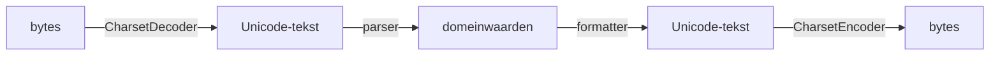

# 07 — I/O, bestanden en NIO

[← Standaardbibliotheek](../06-standaardbibliotheek/README.md) ·
[Inhoudsopgave](../../INHOUDSOPGAVE.md) ·
[Concurrency →](../08-concurrency/README.md)

## Bytes, tekens en grenzen



Een encoding is alleen relevant bij de grens tussen bytes en tekst. Kies die
expliciet, doorgaans UTF-8:

```java
String tekst = Files.readString(pad, StandardCharsets.UTF_8);
Files.writeString(doel, tekst, StandardCharsets.UTF_8);
```

Een verkeerd gekozen charset kan data stil beschadigen. Een Unicode-string
heeft intern geen “UTF-8-encoding”; UTF-8 is een bytecodering.

## Klassieke streams

| Bytes | Tekens |
|---|---|
| `InputStream` | `Reader` |
| `OutputStream` | `Writer` |
| `BufferedInputStream` | `BufferedReader` |
| `BufferedOutputStream` | `BufferedWriter` |
| `ByteArrayInputStream` | `StringReader` |

Bruggen:

```java
Reader reader = new InputStreamReader(inputStream, StandardCharsets.UTF_8);
Writer writer = new OutputStreamWriter(outputStream, StandardCharsets.UTF_8);
```

Lees totdat `read` `-1` retourneert. Eén `read(byte[])` hoeft de buffer niet
volledig te vullen:

```java
byte[] buffer = new byte[8192];
int gelezen;
while ((gelezen = input.read(buffer)) != -1) {
    output.write(buffer, 0, gelezen);
}
```

Voor veel gevallen bestaat `transferTo`, maar limieten en cancellation blijven
applicatieverantwoordelijkheid.

## Buffering en flush

Buffering vermindert kleine OS-calls. `flush` duwt Java-bufferdata door naar de
onderliggende stream, maar garandeert niet dat data fysiek duurzaam op disk
staat. Voor durability zijn filesystem- en channeloperaties plus protocol nodig.

Sluit de buitenste wrapper:

```java
try (var writer = Files.newBufferedWriter(
        pad,
        StandardCharsets.UTF_8,
        StandardOpenOption.CREATE,
        StandardOpenOption.TRUNCATE_EXISTING)) {
    writer.write("inhoud");
}
```

Sluit geen stream die je niet bezit, tenzij het contract ownership overdraagt.

## `Path` en `Files`

`Path` modelleert een pad; het bestand hoeft nog niet te bestaan.

```java
Path basis = Path.of("data").toAbsolutePath().normalize();
Path bestand = basis.resolve("invoer.csv");

if (Files.isRegularFile(bestand)) {
    long grootte = Files.size(bestand);
}
```

Handige operaties:

- `exists`, `isRegularFile`, `isDirectory`, `isReadable`;
- `createDirectories`, `createTempFile`;
- `copy`, `move`, `deleteIfExists`;
- `readString`, `readAllBytes`, `readAllLines`;
- `newInputStream`, `newBufferedReader`, `newByteChannel`;
- `list`, `walk`, `find`;
- `getLastModifiedTime`, `readAttributes`.

`Files.list` en `Files.walk` retourneren een stream die gesloten moet worden:

```java
try (Stream<Path> paden = Files.walk(basis)) {
    List<Path> javaBestanden = paden
            .filter(p -> p.toString().endsWith(".java"))
            .toList();
}
```

## Padveiligheid

Een lexicale normalize is geen securitybewijs bij symbolic links:

```java
Path kandidaat = basis.resolve(userInput).normalize();
if (!kandidaat.startsWith(basis)) {
    throw new SecurityException("Pad buiten basis");
}
```

Dit blokkeert eenvoudige `..` traversal, maar symlink-races vereisen
sterkere maatregelen: gecontroleerde filesystem-layout, `toRealPath`,
platformcapabilities en minimale OS-permissies.

Gebruik veilige tijdelijke bestanden via `Files.createTempFile`; verzin geen
voorspelbare naam.

## Atomisch publiceren

Schrijf complexe output eerst naar een tijdelijk bestand in hetzelfde
filesystem, flush/valideer en verplaats:

```java
Path tijdelijk = Files.createTempFile(doel.getParent(), "nieuw-", ".tmp");
try {
    Files.writeString(tijdelijk, inhoud, StandardCharsets.UTF_8);
    Files.move(
            tijdelijk,
            doel,
            StandardCopyOption.ATOMIC_MOVE,
            StandardCopyOption.REPLACE_EXISTING);
} finally {
    Files.deleteIfExists(tijdelijk);
}
```

`ATOMIC_MOVE` kan unsupported zijn; bepaal bewust fallbackgedrag.

## Kanalen en buffers

NIO gebruikt channels voor verbindingen en `Buffer` voor stateful
lees-/schrijfvensters:

```java
ByteBuffer buffer = ByteBuffer.allocate(4096);
while (channel.read(buffer) != -1) {
    buffer.flip();          // schrijven → lezen
    while (buffer.hasRemaining()) {
        verwerk(buffer.get());
    }
    buffer.clear();         // opnieuw schrijven
}
```

Bufferbegrippen:

- `capacity`: vaste opslaggrootte;
- `position`: volgende lees-/schrijfindex;
- `limit`: grens die niet overschreden wordt;
- `flip`: limit=position, position=0;
- `clear`: volledige capaciteit opnieuw beschikbaar;
- `compact`: ongelezen bytes behouden en schrijfruimte maken.

Direct buffers kunnen native I/O-kopieën verminderen, maar allocatie en
vrijgave zijn duurder en native memory moet gemonitord worden.

## Channels, selectors en async I/O

- `FileChannel`: bestanden, posities, locks, transfer, memory mapping.
- `SocketChannel`/`ServerSocketChannel`: TCP.
- `DatagramChannel`: UDP.
- `Selector`: één thread observeert readiness van veel non-blocking channels.
- `AsynchronousFileChannel`/`AsynchronousSocketChannel`: completionstijl.

Non-blocking is niet hetzelfde als sneller. Het kan threadgebruik beheersen,
maar vraagt een complex state machine. Virtual threads maken een eenvoudige
blocking stijl vaak schaalbaar voor veel onafhankelijke I/O.

## File locks en memory mapping

File locks zijn platformspecifiek/advisory en geen vervanging voor
transactionele opslag.

`FileChannel.map` geeft een memory-mapped buffer. Dat kan grote willekeurige
toegang versnellen, maar introduceert native-memory-, unmapping- en
filesystemcomplexiteit. Meet en ontwerp failure semantics.

## Objectserialisatie

Java native objectserialisatie (`Serializable`, `ObjectInputStream`) heeft
fragiele versiecontracten en ernstige risico's bij onbetrouwbare data.

Voor nieuwe externe formaten:

- kies een expliciet schema/protocol;
- valideer limieten en types;
- versioneer het formaat;
- behandel parsing als trust boundary;
- vermijd native deserialisatie van onbetrouwbare bytes.

`serialVersionUID` lost semantische compatibiliteit niet op.

## Compressie en archieven

`GZIPInputStream`, `ZipInputStream` en `ZipFile` verwerken standaardformaten.
Bescherm tegen zip bombs:

- maximum aantal entries;
- maximum uitgepakte bytes;
- compressieratio en diepte;
- doelpaden normaliseren en binnen basis houden (“Zip Slip”);
- CPU-/tijdlimieten.

## Watch service

`WatchService` kan directorywijzigingen signaleren. Events kunnen worden
samengevoegd of verloren (`OVERFLOW`); bouw een rescanstrategie. Verwacht
platformverschillen en debounce snel opeenvolgende wijzigingen.

## Veelgemaakte fouten

- Default charset gebruiken.
- Aannemen dat `read` een buffer vult.
- `Files.lines`/`walk` niet sluiten.
- Onbegrensd `readAllBytes` op externe input.
- Userpad alleen met `normalize` als volledig veilig beschouwen.
- Output direct overschrijven zonder crashsafe strategie.
- Een direct buffer gebruiken zonder native-memorymeting.
- Java deserialisatie op onbetrouwbare data.

## Checklist

- [ ] Ik scheid bytes, tekst, charset en parsing.
- [ ] Ik sluit alleen resources die ik bezit en gebruik try-with-resources.
- [ ] Ik begrijp partial reads, buffering en flush.
- [ ] Ik werk met `Path`/`Files` en verdedig padgrenzen.
- [ ] Ik kan bufferposition, limit, flip, clear en compact uitleggen.
- [ ] Ik kies bewust blocking, non-blocking of async I/O.
- [ ] Ik begrens data, archieven en serialisatie-input.

## Verder

- [Concurrency](../08-concurrency/README.md)
- [Netwerk en security](../11-netwerk-security/README.md)
- [Data en JDBC](../12-data-jdbc/README.md)
