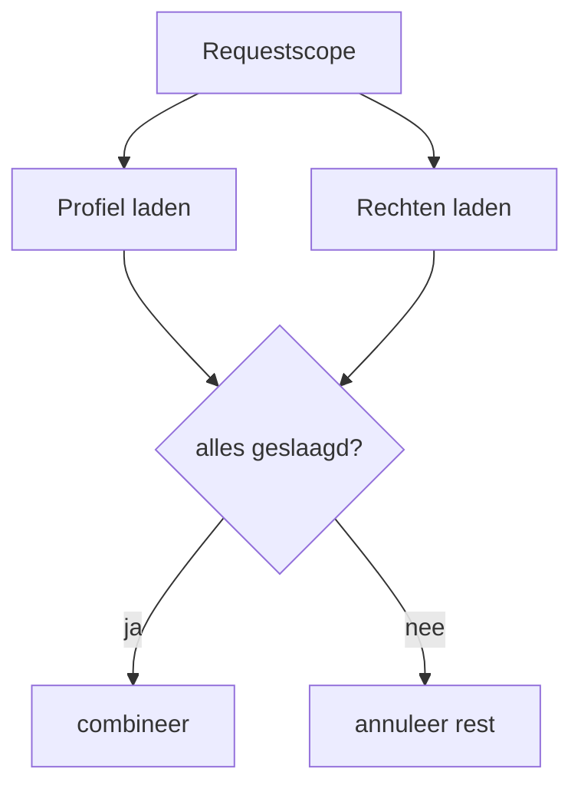

# 08 — Concurrency

[← I/O en NIO](../07-io-nio/README.md) ·
[Inhoudsopgave](../../INHOUDSOPGAVE.md) ·
[JVM internals →](../09-jvm/README.md)

> [!IMPORTANT]
> Lees naast dit overzicht de aparte
> [Java Memory Model-uitleg](./memory-model.md). Zonder happens-before is
> thread-safety vooral toeval.

## Processen, threads en taken

- Een **proces** heeft eigen adresruimte en OS-resources.
- Een **platformthread** correspondeert doorgaans met een kostbare OS-thread.
- Een **virtual thread** is een lichte Java-thread die de JVM op carriers plant.
- Een **task** is werk; ze hoeft niet hetzelfde te zijn als een thread.

Ontwerp rond taken, ownership en cancellation. Maak niet voor ieder concept
zelf een onbeheerde thread.

```java
Thread thread = Thread.ofPlatform()
        .name("rapport-werker")
        .start(() -> maakRapport());
thread.join();
```

Een thread kan slechts één keer worden gestart. Een uncaught exception
beëindigt die thread; configureer logging/handling op de juiste grens.

## Waarom races ontstaan

```java
class Teller {
    private int waarde;

    void verhoog() {
        waarde++; // lezen, optellen, schrijven: niet atomair
    }
}
```

Twee threads kunnen dezelfde oude waarde lezen en één update verliezen.
Daarnaast mag een thread zonder synchronisatie een oude waarde blijven zien.

Thread-safety vereist aandacht voor:

1. **atomicity** — welke handelingen vormen één ondeelbare overgang?
2. **visibility** — wanneer ziet een andere thread de write?
3. **ordering** — welke herordening is toegestaan?
4. **invariants** — welke velden moeten samen consistent veranderen?

## Gedeelde mutable state beperken

Voorkeursvolgorde:

1. immutable data;
2. thread confinement/ownership;
3. message passing en queues;
4. atomic/concurrent datastructuren;
5. locks rond een expliciete invariant.

Een object is effectief immutable als het na veilige publicatie nooit verandert.
“We muteren het meestal niet” is geen synchronisatiecontract.

## `synchronized`

```java
public final class Rekening {
    private long saldo;

    public synchronized void boek(long verschil) {
        long nieuwSaldo = Math.addExact(saldo, verschil);
        if (nieuwSaldo < 0) {
            throw new IllegalStateException("Onvoldoende saldo");
        }
        saldo = nieuwSaldo;
    }

    public synchronized long saldo() {
        return saldo;
    }
}
```

Een intrinsic monitor:

- garandeert mutual exclusion voor dezelfde monitor;
- geeft happens-before tussen unlock en latere lock;
- is reentrant;
- wordt automatisch vrijgegeven bij normale én abrupte exit.

Synchroniseer alle toegang die bij dezelfde invariant hoort op dezelfde,
private lock. Synchroniseren op publiek bereikbare strings, boxed values of
classobjecten maakt externe lockinteractie mogelijk.

### Wachten op een conditie

Legacy monitorprotocol:

```java
synchronized (lock) {
    while (!conditie()) {
        lock.wait();
    }
    wijzigToestand();
}
```

Gebruik `while`, niet `if`, vanwege spurious wakeups en concurrerende
statewijzigingen. `wait`, `notify`, `notifyAll` vereisen monitorownership.
Hogere abstraheringen zoals `BlockingQueue`, `CountDownLatch` of `Condition`
zijn vaak duidelijker.

## `volatile`

```java
private volatile boolean stoppen;
```

Een volatile write happens-before een latere volatile read van hetzelfde veld.
Geschikt voor onafhankelijke status/publicatie waarbij één write de volledige
toestand vertegenwoordigt.

Niet voldoende voor samengestelde updates:

```java
private volatile int teller;
teller++; // nog steeds read-modify-write race
```

Gebruik `AtomicInteger.incrementAndGet`, een lock of ownership.

## Atomics

```java
AtomicLong teller = new AtomicLong();
long nieuw = teller.incrementAndGet();

status.updateAndGet(oud -> volgende(oud));
```

Atomics ondersteunen compare-and-set (CAS). Updatefuncties kunnen bij
contention meermaals worden uitgevoerd en moeten daarom side-effectvrij zijn.

- `AtomicLong`: exacte atomische waarde.
- `LongAdder`: schaalbare telling onder hoge write-contention; `sum()` is geen
  transactionele snapshot.
- `AtomicReference`: atomische stateovergang als één immutable waarde.

## Expliciete locks

```java
Lock lock = new ReentrantLock();
lock.lock();
try {
    wijzig();
} finally {
    lock.unlock();
}
```

`Lock` biedt onder andere interruptible lock acquisition, `tryLock`, fairness
en meerdere `Condition`s. De prijs is handmatig, foutgevoelig vrijgeven.

`ReadWriteLock` helpt alleen bij passend lees-zwaar gedrag en voldoende lang
werk. `StampedLock` ondersteunt optimistic reads maar is niet reentrant en
vraagt bijzonder zorgvuldig validatie-/exceptionontwerp.

## Executors

Scheid taakindiening van uitvoeringsbeleid:

```java
try (ExecutorService executor = Executors.newFixedThreadPool(4)) {
    Future<Rapport> toekomst = executor.submit(this::bouwRapport);
    Rapport rapport = toekomst.get(10, TimeUnit.SECONDS);
}
```

Een poolconfiguratie bepaalt:

- aantal workers;
- queue en begrenzing;
- rejection policy/backpressure;
- threadnamen en uncaught handling;
- lifecycle/shutdown.

Een onbegrensde queue verplaatst overload naar geheugen en latency. Een
begrensde queue vereist expliciet beleid wanneer producers sneller zijn dan
consumers.

### Future

`Future` ondersteunt wachten, timeout en cancellation. `cancel(true)` vraagt
interrupt aan; het kan werk niet magisch veilig stoppen. Taken moeten
interruption respecteren en resources opruimen.

## `CompletableFuture`

```java
CompletableFuture<Profiel> profiel =
        CompletableFuture.supplyAsync(() -> laadProfiel(id), ioExecutor);

CompletableFuture<Voorkeuren> voorkeuren =
        CompletableFuture.supplyAsync(() -> laadVoorkeuren(id), ioExecutor);

CompletableFuture<Pagina> pagina = profiel.thenCombine(
        voorkeuren,
        Pagina::new);
```

| Methodefamilie | Betekenis |
|---|---|
| `thenApply` | synchrone mapping |
| `thenCompose` | async flatMap |
| `thenCombine` | twee onafhankelijke resultaten combineren |
| `allOf`/`anyOf` | meerdere futures coördineren |
| `exceptionally` | herstellen naar waarde |
| `handle` | succes of fout transformeren |
| `whenComplete` | observerend side effect |

Methods met suffix `Async` plannen apart, standaard vaak op de common pool.
Geef voor blocking taken een passende executor. Exceptions zijn meestal
verpakt in `CompletionException`/`ExecutionException`; unwrap zorgvuldig.

## Virtual threads

Virtual threads zijn stabiel sinds Java 21:

```java
try (var executor = Executors.newVirtualThreadPerTaskExecutor()) {
    List<Future<Antwoord>> futures = verzoeken.stream()
            .map(v -> executor.submit(() -> roepServiceAan(v)))
            .toList();

    for (Future<Antwoord> future : futures) {
        verwerk(future.get());
    }
}
```

Goed voor veel onafhankelijke, hoofdzakelijk blocking I/O-taken. Ze maken
thread-per-request opnieuw praktisch.

Ze:

- maken CPU-werk niet sneller;
- vervangen geen database-/serviceconcurrencylimiet;
- vragen nog steeds timeouts, cancellation en backpressure;
- horen niet “gepoold” te worden om threadschaarste; begrens de echte resource
  met bijvoorbeeld een semaphore;
- kunnen minder schaalbaar worden bij langdurig pinnen van een carrier door
  bepaalde native/monitorinteracties — meet met JFR.

Gebruik threadlocals terughoudend bij miljoenen virtual threads. Scoped values
bieden voor immutable context een begrensd alternatief.

## Structured concurrency

Structured concurrency behandelt subtaken als één geneste operatie:



Voordelen: lifecycle, foutpropagatie, cancellation en observability volgen de
lexicale scope. In Java 25 is `StructuredTaskScope` nog preview; activeer en
versioneer bewust. Het concept is ook zonder preview bruikbaar bij eigen
executorbeheer: laat taken niet buiten hun owner-scope leven.

## Scoped values

Scoped values geven immutable context aan callees binnen een dynamische scope,
zonder mutable `ThreadLocal`-state:

```java
static final ScopedValue<TraceId> TRACE_ID = ScopedValue.newInstance();

ScopedValue.where(TRACE_ID, traceId)
        .run(() -> verwerkVerzoek());
```

Ze zijn geschikt voor requestcontext die diep gelezen maar niet gewijzigd
wordt, en werken goed met virtual threads/structured concurrency. Ze zijn geen
algemene dependencycontainer.

## Coördinatieprimitieven

| Type | Gebruik |
|---|---|
| `BlockingQueue` | producer-consumer en begrensde buffer |
| `Semaphore` | maximaal N gelijktijdige resourcegebruikers |
| `CountDownLatch` | wachten tot N eenmalige events klaar zijn |
| `CyclicBarrier` | vaste groep per fase samenbrengen |
| `Phaser` | dynamische deelnemers en meerdere fasen |
| `Exchanger` | twee threads wisselen data uit |

Kies een higher-level contract boven losse `wait`/`notify`.

## Deadlock en andere livenessproblemen

- **Deadlock**: cyclische lockafhankelijkheid.
- **Livelock**: threads reageren maar boeken geen voortgang.
- **Starvation**: taak krijgt structureel geen kans/resource.
- **Priority inversion**: hoge prioriteit wacht indirect op lage.

Voorkom deadlock met globale lockvolgorde, één lock per invariant, timeouts of
het vermijden van nested locks. Roep geen onbekende/externe code aan terwijl
je een lock vasthoudt.

## Testen

Concurrencytests mogen geen willekeurige `sleep` als correctnessbewijs
gebruiken. Werk met latches/barriers, timeouts en herhaalde stress. Combineer:

- unit tests voor stateovergangen;
- deterministische coördinatietests;
- stress-/race tooling;
- JFR/profiling onder realistische belasting;
- productie-invarianten en metrics.

## Checklist

- [ ] Ik identificeer gedeelde mutable state en invarianten.
- [ ] Ik begrijp wanneer `synchronized`, `volatile`, atomic of lock past.
- [ ] Ik ontwerp executorcapaciteit, queue, overload en shutdown.
- [ ] Ik geef interrupts, timeouts en cancellation correct door.
- [ ] Ik combineer futures zonder onbedoeld de common pool te blokkeren.
- [ ] Ik gebruik virtual threads voor passend blocking werk en begrens resources.
- [ ] Ik herken deadlock, livelock, starvation en unsafe publication.
- [ ] Ik kan mijn thread-safetyclaim met happens-before onderbouwen.

## Verder

- [Java Memory Model](./memory-model.md)
- [JVM internals](../09-jvm/README.md)
- [Expertpraktijk](../17-expert/README.md)
