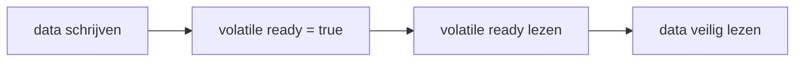

# Java Memory Model

[← Concurrency](./README.md) ·
[Inhoudsopgave](../../INHOUDSOPGAVE.md)

De Java Memory Model (JMM) beschrijft welke waarden reads in een multithreaded
programma mogen waarnemen. Hij is geen diagram van CPU-cache of JVM-geheugenzones.

## Actions en happens-before

Als actie A **happens-before** actie B, dan zijn de effecten van A zichtbaar
voor B en is A vóór B geordend voor het JMM-contract.

Belangrijke regels:

| Regel | Happens-before-relatie |
|---|---|
| Program order | eerdere actie in één thread → latere actie |
| Monitor | unlock monitor → latere lock van dezelfde monitor |
| Volatile | write veld → latere read van hetzelfde volatile veld |
| Thread start | acties vóór `start` → acties in gestarte thread |
| Thread termination | acties in thread → succesvolle `join`/detectie einde |
| Transitiviteit | A → B en B → C impliceert A → C |
| Future/task API | indiening → taak; taak → succesvolle result retrieval volgens contract |



```java
class Publicatie {
    private int resultaat;
    private volatile boolean klaar;

    void produceer() {
        resultaat = bereken();
        klaar = true;
    }

    int consumeer() {
        if (!klaar) {
            throw new IllegalStateException("Nog niet klaar");
        }
        return resultaat;
    }
}
```

De volatile write/read publiceert ook eerdere writes. Zonder die relatie is een
data race en zijn intuïtieve broncodevolgorde en cachecoherentie geen bewijs.

## Atomicity

Reads/writes van afzonderlijke referenties en de meeste primitieve waarden zijn
atomair, maar samengestelde logica niet:

```java
if (!map.containsKey(sleutel)) {
    map.put(sleutel, waarde);
}
```

Zelfs met een thread-safe map kan een andere thread tussen beide calls
handelen. Gebruik `putIfAbsent` of `computeIfAbsent` volgens het API-contract.

Atomiciteit is domeinafhankelijk. Twee atomische velden geven geen atomische
invariant over hun combinatie.

## Visibility en herordening

Compiler, JIT en processor mogen herordenen zolang één thread geen verschil
mag zien en happens-before-contracten behouden blijven. Een data-racevrij
programma krijgt sequentially consistent gedrag voor zijn correct
gesynchroniseerde acties; een programma met races mag verrassende oude of
gemengde observaties zien.

Gebruik `volatile`/locks, geen folklore zoals:

- “de write is klein”;
- “de threads draaien op dezelfde core”;
- “ik heb logging toegevoegd”;
- `sleep` als publicatiebarrière;
- toevallig correct gedrag op één JVM/architectuur.

## Safe publication

Een volledig geconstrueerd object veilig delen kan onder andere via:

- static initialization;
- volatile field;
- lock-protected field;
- thread-safe collection;
- vóór `Thread.start`;
- taskindiening volgens executorcontract.

`final` velden hebben aanvullende initialisatiegaranties als `this` tijdens de
constructor niet ontsnapt.

Onveilige escape:

```java
class Luisteraar {
    private final int grens;

    Luisteraar(Bron bron) {
        bron.registreer(() -> gebruik(grens)); // this kan te vroeg ontsnappen
        grens = 10;
    }
}
```

Registreer na constructie via factory/startmethode.

## `volatile` versus lock

| Vraag | `volatile` | Lock/`synchronized` |
|---|---:|---:|
| zichtbaarheid | ja | ja |
| enkele read/write atomair | ja | ja |
| read-modify-write atomair | nee | ja |
| meerdere velden als invariant | nee | ja |
| wachten/conditie | polling mogelijk, meestal niet | condition/wait mogelijk |
| blocking | nee | bij contention |

Een immutable stateholder in één `AtomicReference` kan een meer-veldenovergang
atomair maken:

```java
record Config(String endpoint, Duration timeout) {}

AtomicReference<Config> config = new AtomicReference<>(beginConfig);
config.updateAndGet(oud -> new Config(nieuwEndpoint, oud.timeout()));
```

## CAS en ABA

Compare-and-set wijzigt alleen als de huidige waarde gelijk is aan de verwachte
waarde. Onder contention kan een lus herhalen.

Het ABA-probleem: waarde A verandert naar B en terug naar A; een CAS ziet A en
merkt de tussenwijziging niet. Als die geschiedenis relevant is, gebruik een
versie/stamp (`AtomicStampedReference`) of ander ontwerp.

## Liveness en fairness

De JMM garandeert visibility/orderingrelaties, niet automatisch:

- eerlijke threadplanning;
- voortgang binnen een deadline;
- afwezigheid van deadlock;
- starvation freedom;
- bounded latency.

Thread-safety omvat safety (“niets fout”) en vaak liveness (“er gebeurt
uiteindelijk iets”). Documenteer beide.

## Litmusvragen

1. Is een niet-volatile boolean stopflag veilig? Nee, er ontbreekt een
   happens-before-relatie.
2. Maakt `volatile List<X>` de lijst thread-safe? Nee, alleen de referentie heeft
   volatile semantics.
3. Mag je double-checked locking gebruiken? Ja, als het instanceveld `volatile`
   is en constructie niet ontsnapt; eenvoudiger initialisatievormen zijn vaak beter.
4. Is `final` hetzelfde als immutable? Nee; het voorkomt reassignment van het
   veld, niet mutatie van het verwezen object.
5. Is `ConcurrentHashMap` plus `size()` een stabiele globale snapshot? Niet
   noodzakelijk bij gelijktijdige mutatie; lees het specifieke contract.

## Checklist

- [ ] Voor iedere gedeelde write/read kan ik de happens-before-keten aanwijzen.
- [ ] Ik onderscheid atomicity, visibility, ordering en liveness.
- [ ] Objecten worden veilig gepubliceerd en `this` ontsnapt niet tijdens bouw.
- [ ] Samengestelde invarianten hebben één synchronisatiegrens.
- [ ] Ik vertrouw niet op timing, logging of hardwaretoeval.
- [ ] Ik ken de beperkingen van volatile, CAS en weakly consistent views.

## Primaire bron

- [JLS hoofdstuk 17 — Threads and Locks][jls-17]

[jls-17]: https://docs.oracle.com/javase/specs/jls/se25/html/jls-17.html
