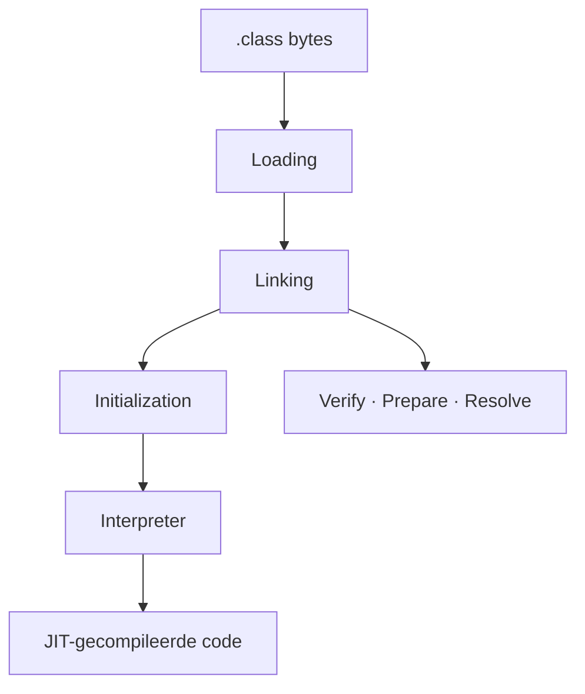
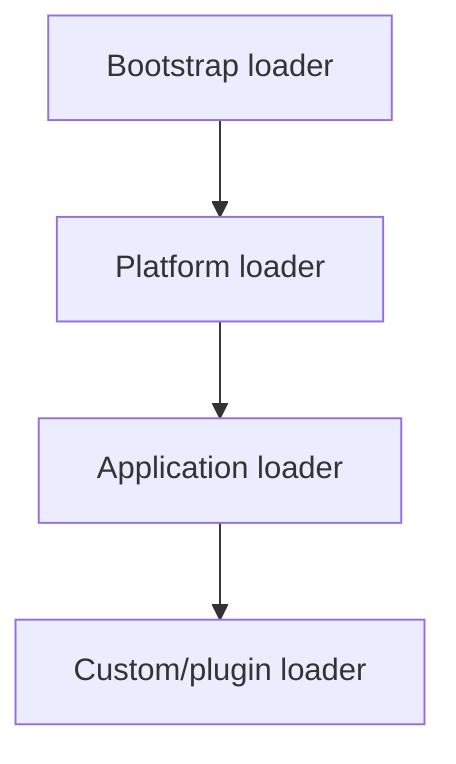

# 09 — JVM internals

[← Concurrency](../08-concurrency/README.md) ·
[Inhoudsopgave](../../INHOUDSOPGAVE.md) ·
[Reflectie en modules →](../10-reflectie-modules/README.md)

> [!NOTE]
> Taalregels komen uit de JLS; classfile- en uitvoeringsregels uit de JVMS;
> collector- en JIT-details kunnen HotSpot-implementatiespecifiek zijn.

## Van classfile naar uitvoering



Een classfile bevat onder andere:

- magic/version;
- constant pool;
- class-, field- en methodedescriptors;
- bytecode per methode;
- attributen zoals line numbers, annotations en bootstrap methods.

Inspecteer:

```bash
javac Voorbeeld.java
javap -c -v -p Voorbeeld.class
```

Bronconstructies hoeven niet één-op-één in bytecode te bestaan. Lambdas
gebruiken vaak `invokedynamic`; generics zijn grotendeels erased; `try/finally`
wordt control flow en exception tables.

## Loading, linking en initialization

1. **Loading**: bytes vinden en `Class`-object maken.
2. **Verification**: structurele en typeveiligheidschecks.
3. **Preparation**: static storage/defaultwaarden.
4. **Resolution**: symbolische references naar concrete runtime-entiteiten.
5. **Initialization**: static initializers en assignments uitvoeren.

Resolution kan lazy zijn. Initialization gebeurt bij specifieke actieve
gebruiken en is gesynchroniseerd. Een fout in static initialization kan de
class voor die classloader onbruikbaar maken.

## Classloaders en identiteit

Classidentiteit is combinatie van volledig gekwalificeerde naam **en defining
classloader**. Dezelfde bytes door twee sibling loaders zijn twee incompatibele
runtime-types.

Gebruikelijke delegatie:



Parent-first delegation voorkomt doorgaans dat applicatiecode platformclasses
overschrijft. Plugincontainers kunnen andere strategieën gebruiken.

Classloaderlekken ontstaan wanneer een langlevende loader references houdt
naar pluginclasses, of omgekeerd via threads, threadlocals, statics, drivers,
callbacks of caches.

## Runtimegeheugen

| Gebied | Globaal/per thread | Bevat |
|---|---|---|
| heap | gedeeld | objecten en arrays |
| Java stack | per thread | frames, locals, operand stack |
| metaspace | gedeeld/native | classmetadata |
| code cache | gedeeld/native | JIT-gecompileerde code |
| PC register | per thread | huidige instructiecontext |
| native stack | per thread | native calls |
| direct/native memory | proces | buffers, JVM-structuren, libraries |

`OutOfMemoryError` betekent dus niet altijd “Java heap vol”. Lees het subtype en
meet heap, metaspace, direct memory, threadstacks en native allocations.

Details: [Geheugen, GC en JIT](./geheugen-gc-jit.md).

## Stackframes

Elke methodecall krijgt conceptueel een frame met:

- local-variable array (`this`, parameters, locals);
- operand stack;
- reference naar runtime constant pool;
- return/exceptioninformatie.

Een te diepe call chain geeft `StackOverflowError`. Stackgrootte per
platformthread beïnvloedt maximaal aantal threads; virtual threads beheren
stacks anders en laten ze groeien/krimpen.

## Exceptions in de VM

Bij `athrow` zoekt de JVM een passende handler in het huidige frame en
unwindt anders frames. `finally` is compilercode die relevante paden uitvoert,
niet een magische JVM-callback.

Stack traces zijn snapshots en kunnen door optimalisatie details missen of
anders worden gereconstrueerd. Gebruik ze als bewijs, maar combineer met events
en context.

## Native grens

JNI verbindt Java met native code maar kan VM-crashes, geheugenfouten en
portableheidsproblemen introduceren. De Foreign Function & Memory API biedt
een modernere, gecontroleerdere route voor native calls en off-heap memory.

Native code valt buiten garbage-collected veiligheid. Definieer ownership,
lifetime, alignment, threadregels en foutconversie expliciet.

## JVM-opties

Optiecategorieën:

- standaard: `-D`, `-cp`, `--module-path`;
- `-X`: niet-standaard maar gangbaar;
- `-XX`: geavanceerd/implementatiespecifiek;
- diagnostisch/experimenteel: kan unlockflags of andere support vereisen.

Kopieer geen “snelle JVM-flags” uit oude blogs. Defaults veranderen per
release en workload. Leg reden, meetmethode en rollback vast.

## Observabilitytools

| Tool | Vraag |
|---|---|
| `jps` | welke Java-processen? |
| `jcmd` | welke diagnostische commands zijn beschikbaar? |
| `jstack` | waar staan platformthreads/locks? |
| `jmap` | heapinfo/dump (met operationele impact) |
| `jstat` | JVM/GC-statistieken |
| `jinfo` | flags/properties |
| JFR | events over CPU, allocatie, locks, I/O, GC |
| JDK Mission Control | JFR interactief analyseren |

Start een beperkte opname:

```bash
jcmd <pid> JFR.start name=incident settings=profile duration=2m filename=incident.jfr
jfr summary incident.jfr
```

Controleer eerst beschikbare commands en productierisico. Sommige heap- of
threadoperaties kunnen processen pauzeren of veel diskruimte gebruiken.

## CDS en AOT

Class Data Sharing (CDS) deelt vooraf verwerkte classmetadata om startup en
footprint te verbeteren. Recente JDK's bouwen AOT-caching verder uit. Dit is
niet hetzelfde als een volledig native executable: de JVM en dynamische JIT
blijven relevant.

Optimaliseer startup, warm-up, throughput en footprint als aparte doelen.

## Veelgemaakte fouten

- JVM, HotSpot en Java-taal als synoniemen gebruiken.
- Heapgrafiek als volledig procesgeheugen zien.
- `System.gc()` als gegarandeerde collectie of oplossing gebruiken.
- Classloaderidentiteit negeren in plugin-/containerbugs.
- Eén thread dump als bewijs van een blijvend probleem zien.
- JIT-warm-up negeren bij benchmarks.
- Interne JDK-API als stabiel contract behandelen.

## Checklist

- [ ] Ik kan loading, linking en initialization onderscheiden.
- [ ] Ik begrijp classidentiteit en delegation.
- [ ] Ik kan heap, stack, metaspace, code cache en native memory plaatsen.
- [ ] Ik lees eenvoudige bytecode met `javap`.
- [ ] Ik kies een diagnostische tool op concrete vraag.
- [ ] Ik scheid specificatie van HotSpot-implementatie.
- [ ] Ik wijzig JVM-flags alleen met hypothese, meting en rollback.

## Verder

- [Geheugen, GC en JIT](./geheugen-gc-jit.md)
- [Reflectie en modules](../10-reflectie-modules/README.md)
- [Expertpraktijk](../17-expert/README.md)
