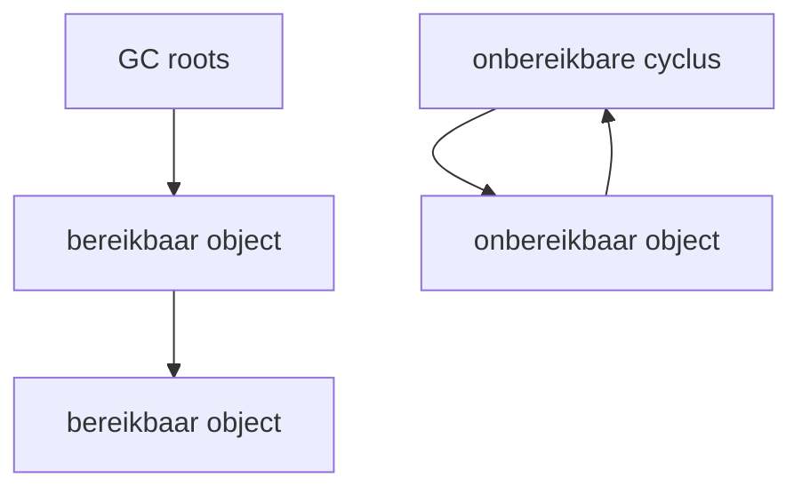
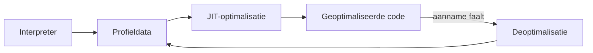

# Geheugen, garbage collection en JIT

[← JVM internals](./README.md) ·
[Inhoudsopgave](../../INHOUDSOPGAVE.md)

## Reachability, niet “scope”, bepaalt collectie

Garbage collectors vinden objecten die niet meer sterk bereikbaar zijn vanaf
GC roots, zoals live threadstacks, statics, JNI-references en JVM-structuren.

Cycli zijn geen probleem als de hele cyclus onbereikbaar is. Een geheugenlek
in Java is meestal een object dat technisch nog bereikbaar maar logisch
onnodig is.

## Reference strengths

| Reference | Globale bedoeling |
|---|---|
| strong | normaal; blijft zolang bereikbaar |
| `SoftReference` | memory-sensitive cachehint; onvoorspelbaar |
| `WeakReference` | verdwijnt als alleen weak bereikbaar |
| `PhantomReference` | post-mortem cleanuptracking met queue |

Gebruik reference types niet als magische cache. Een begrensde cache met
expliciete eviction en metrics is meestal beter te begrijpen.

## Generational hypothese

Veel objecten sterven jong. Generational collectors optimaliseren daarom jonge
en oude gebieden anders. Begrippen als Eden/Survivor zijn collectorspecifieke
uitwerkingen, geen universele Java-taalregel.

Metrieken:

- allocation rate;
- live-setgrootte;
- promoted bytes;
- pause duration en frequentie;
- concurrent cycle duration;
- humongous/large allocations;
- mutator utilization.

Allocation is vaak goedkoop; langlevende retention en hoge allocation rate
kunnen duur worden. Optimaliseer niet automatisch elk tijdelijk object weg.

## Collectors kiezen

Beschikbaarheid/defaults kunnen per JDK en platform veranderen.

| Collectorfamilie | Prioriteit/karakter |
|---|---|
| Serial | eenvoud, kleine heaps/single CPU |
| Parallel | throughput met stop-the-world parallelisme |
| G1 | gebalanceerde algemene collector, regio-gebaseerd |
| ZGC | zeer lage pauzes, concurrent |
| Shenandoah | lage pauzes, concurrent (distributieafhankelijk) |

Keuze hangt af van latency-SLO, throughput, heap, CPU-budget, containerlimieten
en workload. Test met productieachtig verkeer en dezelfde JDK-build.

## GC is geen resourcebeheer

Een onbereikbaar bestand- of socketobject garandeert geen tijdige close.
Gebruik try-with-resources. Finalization is deprecated for removal en kan
retentie, onvoorspelbaarheid en securityproblemen veroorzaken.

## Heap sizing

- `-Xms`: initiële/minimale heapdoelinstelling.
- `-Xmx`: maximale heap.
- percentageflags kunnen containergeheugen volgen.

Een grotere heap:

- kan collectiefrequentie verlagen;
- verhoogt footprint;
- kan lekdetectie vertragen;
- kan bij sommige collectors/cycli langere verwerking geven.

Laat ruimte voor metaspace, code cache, direct buffers, threadstacks, native
libraries en OS. Containerlimit =/= veilig volledig aan heap toewijzen.

## Memory leaks diagnosticeren

1. Bevestig groei over volledige GC/cycli, niet alleen sawtooth.
2. Onderscheid heap van native/RSS.
3. Neem onder gecontroleerde omstandigheden een heap dump/histogram.
4. Zoek dominators en retentiepad naar GC root.
5. Koppel objecttype aan ownership/lifecycle.
6. Reproduceer en verifieer dat retentie stabiliseert.

Typische oorzaken:

- onbegrensde maps/queues/caches;
- listeners/callbacks niet afmelden;
- `ThreadLocal` bij poolthreads;
- classloaderretentie;
- grote backing arrays/views;
- resources of native buffers;
- metrics met onbegrensde labelcardinaliteit.

## JIT-compilatie

Hot code start geïnterpreteerd of op lager compilatieniveau en wordt op basis
van profielen geoptimaliseerd:

Mogelijke optimalisaties:

- method inlining;
- dead-code elimination;
- loop transformations;
- constant folding;
- escape analysis en scalar replacement;
- speculative devirtualization.

Dit maakt Java snel, maar naïeve microbenchmarks misleidend.

## Escape analysis

De JIT kan bewijzen dat een object niet ontsnapt en allocatie/locks
optimaliseren. Programmeer niet tegen een veronderstelde optimalisatie;
controleer gegenereerd gedrag alleen als profiling die verdieping rechtvaardigt.

## Warm-up, tiering en deoptimization

Performance verandert tijdens:

- classloading;
- profiling;
- compilation;
- cachevulling;
- GC-aanpassing;
- OS-/CPU-frequentie;
- deoptimization.

Meet steady state én startup als beide relevant zijn. JMH behandelt veel
microbenchmarkmechanica, maar geen onrealistische workloadkeuze.

## CPU versus allocatie

Een CPU-profiel toont waar tijd wordt gesampled; een allocationprofiel toont
waar objecten ontstaan. De methode die veel alloceert is niet noodzakelijk de
retainer. Een heap dump toont retentie, niet volledige allocatiegeschiedenis.

Formuleer eerst de vraag:

| Symptoom | Eerste bewijs |
|---|---|
| hoge CPU | JFR/async profiel, hostmetrics |
| lange GC-pauzes | GC/JFR-events, live set |
| heap groeit | old/live-settrend, histogram/dump |
| RSS groeit, heap stabiel | native memory, threads, direct buffers |
| p99-latency | requesttraces + JFR rond tijdvenster |
| lockcontention | JFR lock/park-events, thread dumps |

## Checklist

- [ ] Ik onderscheid bereikbaarheid, live set, allocatie en retentie.
- [ ] Ik kies collector/heap op SLO en meting.
- [ ] Ik houd buiten-heapgeheugen in het procesbudget.
- [ ] Ik kan een retentiepad naar een GC root interpreteren.
- [ ] Ik begrijp warm-up, profiling, JIT en deoptimization.
- [ ] Ik gebruik de juiste profiler voor CPU, allocatie of retentie.

## Primaire verdieping

- [HotSpot Virtual Machine Garbage Collection Tuning Guide][gc-guide]
- [Java Flight Recorder Runtime Guide][jfr-guide]

[gc-guide]: https://docs.oracle.com/en/java/javase/25/gctuning/
[jfr-guide]: https://docs.oracle.com/en/java/javase/25/jfapi/
