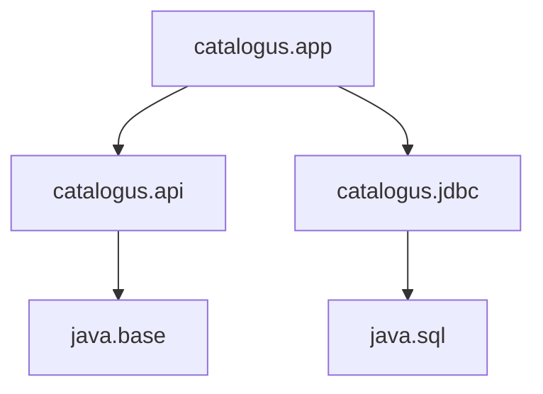

# 10 — Reflectie, metadata en modules

[← JVM internals](../09-jvm/README.md) ·
[Inhoudsopgave](../../INHOUDSOPGAVE.md) ·
[Netwerk en security →](../11-netwerk-security/README.md)

## Classobjecten en runtime-introspectie

Iedere geladen reference type heeft per defining classloader een `Class<?>`:

```java
Class<String> viaLiteral = String.class;
Class<?> viaObject = waarde.getClass();
Class<?> viaNaam = Class.forName("nl.handboek.Plugin");
```

`Class.forName` kan loading en initialization veroorzaken. Gebruik de overload
met expliciete initializeflag/classloader als dat onderscheid belangrijk is.

Primitieven, arrays, annotations, records, enums en interfaces hebben eveneens
Class-representaties met passende querymethoden.

## Reflectie

```java
for (Method methode : type.getDeclaredMethods()) {
    if (methode.isAnnotationPresent(Audit.class)) {
        System.out.println(methode.getName());
    }
}
```

Verschillen:

- `getMethods`: publieke methoden inclusief geërfde;
- `getDeclaredMethods`: alle methoden direct gedeclareerd in deze class;
- vergelijkbaar voor fields/constructors;
- parameter- en generic type-info zijn via gespecialiseerde API's beschikbaar,
  voor zover classfilemetadata ze bevat.

Reflectief aanroepen:

```java
Method methode = type.getDeclaredMethod("verwerk", String.class);
Object resultaat = methode.invoke(instance, "invoer");
```

Nadelen:

- compile-timecontrole verschuift naar runtime;
- exceptions worden gewrapt;
- module-encapsulatie kan toegang blokkeren;
- refactoringtools zien stringnamen minder goed;
- security en performance vragen aandacht.

Cache gevalideerde metadata als reflectie intensief wordt gebruikt, maar maak
classloaderlifecycle niet kapot met globale caches.

## Encapsulatie is een contract

`setAccessible(true)` is geen universele ontsnappingsroute. Sterke
module-encapsulatie kan toegang weigeren. `--add-opens` en `--add-exports`
zijn migratie-/integratiehulpmiddelen, geen gezond permanent API-ontwerp.

Gebruik publieke API, servicecontracten of expliciet geopende packages.

## Method handles en VarHandles

`MethodHandle` is een getypeerde, direct aanroepbare referentie naar methode,
constructor of veldachtige operatie. Lookupobjecten modelleren toegangsrechten.
Ze vormen de basis van veel dynamische runtimefuncties.

```java
MethodHandles.Lookup lookup = MethodHandles.lookup();
MethodHandle lengte = lookup.findVirtual(
        String.class,
        "length",
        MethodType.methodType(int.class));
int n = (int) lengte.invokeExact("Java");
```

`VarHandle` geeft gecontroleerde toegangsmodes tot fields/arrays, inclusief
plain, opaque, acquire/release, volatile en atomic compare-and-set. Gebruik het
alleen met degelijk JMM-begrip; high-level atomics zijn meestal duidelijker.

## Dynamische proxies

JDK-proxies implementeren interfaces:

```java
InvocationHandler handler = (proxy, method, args) -> {
    long start = System.nanoTime();
    try {
        return method.invoke(doel, args);
    } finally {
        registreer(method.getName(), System.nanoTime() - start);
    }
};

Service proxy = (Service) Proxy.newProxyInstance(
        Service.class.getClassLoader(),
        new Class<?>[]{Service.class},
        handler);
```

Behandel `equals`, `hashCode`, `toString`, exception-unwrapping en
recursie zorgvuldig. Proxies zijn geschikt voor cross-cutting gedrag aan een
expliciete grens; ze mogen businessflow niet onzichtbaar maken.

## Annotatieverwerking

Een annotation processor draait tijdens compilatie en werkt met
`javax.lang.model`, niet met runtime-reflectie.


Processors mogen nieuwe bestanden genereren, maar geen bestaande userbron
herschrijven. Zorg voor:

- deterministische output;
- duidelijke foutmeldingen via `Messager`;
- incremental-buildcompatibiliteit;
- geen netwerk/tijdafhankelijke generatie;
- gegenereerde output buiten version control, tenzij bewust anders.

## Runtime-annotaties versus processors

| Vraag | Runtime-reflectie | Compile-time processor |
|---|---:|---:|
| runtimekosten | ja | meestal nee |
| dynamische discovery | ja | beperkt |
| vroege fouten | minder | sterk |
| bron/code genereren | nee | ja |
| RUNTIME retention nodig | ja | nee |

Kies op lifecycle, niet op mode.

## Java Platform Module System

Een module declareert expliciete dependencies en publieke packages:

```java
module nl.handboek.catalogus {
    requires java.sql;
    requires java.net.http;

    exports nl.handboek.catalogus.api;

    uses nl.handboek.catalogus.spi.Zoeker;
    provides nl.handboek.catalogus.spi.Zoeker
            with nl.handboek.catalogus.impl.IndexZoeker;
}
```



Kernbegrippen:

| Directive | Betekenis |
|---|---|
| `requires` | leesbaarheid naar module |
| `requires transitive` | consumers lezen dependency ook |
| `requires static` | vooral compile-time vereist |
| `exports` | public types van package toegankelijk |
| `opens` | diepe reflectie toegestaan |
| `uses` | service consumeert |
| `provides ... with` | implementatie aanbiedt |

`exports` is compile-time/API-toegang; `opens` is deep reflection. Een `open
module` opent alle packages en verzwakt encapsulatie.

## Named, automatic en unnamed modules

- **Named module**: heeft `module-info.class`.
- **Automatic module**: gewone JAR op module path, naam afgeleid/manifest.
- **Unnamed module**: classpathcode, leest alle modules maar is zelf niet
  leesbaar als benoemde dependency.

Split packages (zelfde package in meerdere named modules) zijn niet toegestaan.
Package-ontwerp en modulegrenzen moeten dus samen kloppen.

## ServiceLoader

```java
ServiceLoader<Zoeker> zoekers = ServiceLoader.load(Zoeker.class);
for (Zoeker zoeker : zoekers) {
    registreer(zoeker);
}
```

Dit koppelt consumers aan een interface en providers aan module-/JAR-metadata.
Definieer foutisolatie, providerorde, lifecycle en duplicatebeleid. Een
service locator vervangt geen heldere dependencygraph.

## Custom runtime met `jlink`

```bash
jdeps --print-module-deps app.jar
jlink \
  --add-modules nl.handboek.app \
  --strip-debug \
  --no-header-files \
  --no-man-pages \
  --output runtime
```

`jlink` bouwt een platformgebonden runtime-image uit modules. Test locale,
charset, crypto, service providers en reflectionresources; statische analyse
ziet dynamische dependencies niet altijd.

## Class-file API

De standaard Class-File API (final sinds Java 24) kan classfiles lezen,
genereren en transformeren zonder handmatige byte-level parsing. Ze is
relevant voor tools, instrumentation en language runtimes. Bewaak
classfileversies, verifierregels en transformaties met tests.

## Veelgemaakte fouten

- Reflectie gebruiken waar polymorfisme voldoende is.
- Private internals openen als permanent integratiecontract.
- Classmetadata cachen zonder weak/classloaderbewust lifecyclebeleid.
- Exceptions uit `InvocationTargetException` verkeerd presenteren.
- `exports` en `opens` verwarren.
- Alles in één module plaatsen zonder architectuurwinst.
- Dynamic providers gebruiken zonder deterministische selectie/foutisolatie.

## Checklist

- [ ] Ik kies reflectie alleen bij echte runtime-dynamiek.
- [ ] Ik begrijp lookup/access en module-encapsulatie.
- [ ] Ik kan runtime metadata en annotation processing vergelijken.
- [ ] Ik schrijf een module descriptor met passende `requires`/`exports`.
- [ ] Ik onderscheid classpath, module path, named, automatic en unnamed.
- [ ] Ik kan services ontdekken zonder implementatiedependency.
- [ ] Ik test dynamische dependencies bij `jlink`.

## Verder

- [JVM internals](../09-jvm/README.md)
- [Build en tooling](../14-build-tooling/README.md)
- [Ontwerp en architectuur](../15-architectuur/README.md)
