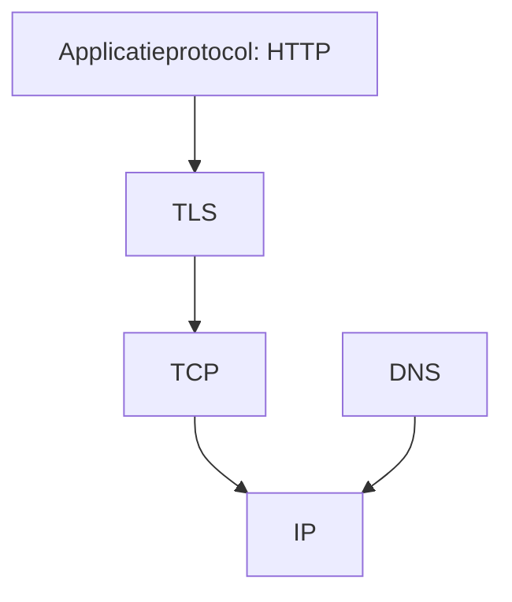

# 11 — Netwerk en security

[← Reflectie en modules](../10-reflectie-modules/README.md) ·
[Inhoudsopgave](../../INHOUDSOPGAVE.md) ·
[Data en JDBC →](../12-data-jdbc/README.md)

Security is geen losse library; het is een eigenschap van grenzen, dataflow,
defaults, deployment en onderhoud.

## Netwerkmodel



- DNS vertaalt namen naar adressen, maar is geen identiteitsbewijs.
- TCP levert een geordende bytestroom, geen message boundaries.
- UDP levert datagrams zonder leverings-/volgordegarantie.
- TLS biedt authenticatie/integriteit/confidentialiteit volgens configuratie.
- HTTP definieert request/response-semantiek boven transport.

Iedere laag kan eigen timeouts, limieten en failure modes hebben.

## URI en URL

`URI` modelleert syntax; `URL` kan protocolhandlers en I/O betrekken. Gebruik
`URI` voor samenstellen/normaliseren en geef hem aan de HTTP Client.

```java
URI uri = URI.create("https://api.example.com/v1/items");
```

Voeg userinput niet met stringconcatenatie in een URL. Encode pathsegmenten en
queryparameters volgens hun eigen context. Controleer scheme, host en port
tegen allowlists als de server externe URL's mag benaderen (SSRF-verdediging).

Redirects kunnen opnieuw securitygrenzen kruisen; valideer eindbestemming en
credentialbeleid.

## Java HTTP Client

```java
HttpClient client = HttpClient.newBuilder()
        .connectTimeout(Duration.ofSeconds(3))
        .followRedirects(HttpClient.Redirect.NORMAL)
        .build();

HttpRequest request = HttpRequest.newBuilder(uri)
        .timeout(Duration.ofSeconds(10))
        .header("Accept", "application/json")
        .GET()
        .build();

HttpResponse<String> response = client.send(
        request,
        HttpResponse.BodyHandlers.ofString(StandardCharsets.UTF_8));
```

Controleer:

- transportfout versus HTTP-status;
- connecttimeout én requesttimeout;
- maximum bodygrootte/streaming;
- charset/content type;
- retrybeleid en idempotentie;
- redirects;
- cancellation/interruption;
- logs zonder tokens of gevoelige payload.

Een `404` is een geslaagd HTTP-transport met applicatiefoutstatus, geen
`IOException`.

### Asynchroon

```java
CompletableFuture<HttpResponse<String>> toekomst =
        client.sendAsync(request, HttpResponse.BodyHandlers.ofString())
                .orTimeout(10, TimeUnit.SECONDS);
```

Plan blocking vervolgstappen niet ongemerkt op dezelfde executor. Definieer
wat timeout met de onderliggende operatie doet en hoe partial work wordt
opgeruimd.

### HTTP/3

Java 26 voegt HTTP/3 aan de HTTP Client API toe. Behandel protocolselectie,
proxy-/netwerkondersteuning en fallback als deploymentvraag; applicatiecorrectheid
mag niet afhangen van een ongeteste transportaanname.

## Sockets

```java
try (Socket socket = new Socket()) {
    socket.connect(new InetSocketAddress(host, port), 3_000);
    socket.setSoTimeout(10_000);
    // framed protocol lezen/schrijven
}
```

Een TCP-read kan minder bytes geven, meerdere messages combineren of midden in
een message eindigen. Definieer framing: lengteprefix, delimiter of
zelfbeschrijvend protocol. Begrens lengtes vóór allocatie.

Bij servers: begrens connections/work, timeouts en requestgrootte. Virtual
threads vereenvoudigen blocking handlers, maar beschermen de database of
downstreamservice niet tegen overload.

## TLS en certificaten

Standaard HTTPS-hostnameverificatie en trustmanager niet uitschakelen.
Een certificaatfout in ontwikkeling “oplossen” met een trust-all manager maakt
man-in-the-middle-aanvallen mogelijk.

Beheer:

- trust anchors/truststore;
- client identity/keystore bij mTLS;
- certificaatrotatie en expiry monitoring;
- toegestane protocolversies/ciphers volgens actueel beleid;
- klokcorrectheid;
- SNI/hostname.

Gebruik `SSLContext` alleen als de defaultconfiguratie het expliciete
trustmodel niet dekt.

## Cryptografische bouwstenen

| Doel | Bouwsteen |
|---|---|
| wachtwoorden bewaren | gespecialiseerde password hashing/KDF met salt en kosten |
| integriteit met gedeeld geheim | MAC, bijvoorbeeld HMAC |
| vertrouwelijkheid + integriteit | authenticated encryption (AEAD) |
| identiteit/ondertekening | digitale signature |
| willekeurige secrets | `SecureRandom` |
| sleutelafleiding | KDF volgens protocol |

Gebruik `Cipher`, `Mac`, `Signature`, `MessageDigest`, `KeyStore` en
`SecureRandom` via exacte, actuele protocolkeuzes. Bouw geen eigen cryptoformat.

```java
byte[] token = new byte[32];
SecureRandom.getInstanceStrong().nextBytes(token);
String zichtbaar = Base64.getUrlEncoder()
        .withoutPadding()
        .encodeToString(token);
```

`getInstanceStrong()` kan afhankelijk van provider/OS blokkeren; voor veel
toepassingen is een correct geïnitialiseerde `new SecureRandom()` geschikt.
Kies op threat model en providerdocumentatie.

### Hashing is geen encryptie

- Hash: eenrichtingsdigest, geen geheimhouding.
- Encoding (Base64/hex): representatie, geen beveiliging.
- Encryptie: sleutelgebonden vertrouwelijkheid.
- MAC/signature: integriteit/authenticiteit met verschillend sleutelmodel.

Vergelijk securitytokens waar nodig constant-time met daarvoor bedoelde API's;
maak geen eigen timinggevoelige lus.

## Input, output en injectie

Validatie is contextspecifiek:

- SQL → parameterized query;
- HTML → contextuele outputencoding;
- shell → geen shellstring, losse argumenten;
- filesystem → pathgrens en OS-permissies;
- log → controlekarakters/secrets;
- regex → quote of begrens patrooncomplexiteit;
- URL → componentencoding en bestemmingcontrole.

Een allowlist van geldige domeinwaarden is sterker dan “verdachte tekens”
weghalen.

## Secrets

- Commit nooit credentials.
- Gebruik een secret manager/deploymentmechanisme.
- Geef secrets niet via commandline als proceslijsten ze tonen.
- Log geen tokens, private keys of volledige connection strings.
- Houd lifetime kort en roteerbaar.
- `char[]` kan eerder worden gewist dan `String`, maar kopieën en runtimegedrag
  beperken de garantie; ontwerp de gehele datastroom.

## Deserialisatie en parserlimieten

Onbetrouwbare data kan leiden tot objectinjectie, memory/CPU exhaustion en
nestingaanvallen. Gebruik expliciete schema's en stel limieten in op:

- totale bytes;
- nestingdiepte;
- aantallen;
- strings/velden;
- decompressie;
- verwerkingstijd.

Als legacy Java-serialisatie onvermijdelijk is, gebruik inputfilters en een
extreem beperkte allowlist. Migreer naar een veilig, versieerbaar formaat.

## Autorisatie en minste privilege

Authenticatie zegt wie een principal is; autorisatie zegt welke actie op welk
object mag. Controleer autorisatie server-side bij iedere relevante operatie,
niet alleen bij UI/navigation.

Beperk:

- filesystem- en netwerktoegang van het OS/container;
- databaseaccountrechten;
- module/API-exposure;
- cloudrollen;
- runtimegebruiker;
- outbound destinations.

## Supply chain

- pin/review dependencies;
- update ondersteunde JDK en libraries;
- genereer dependencyrapport/SBOM waar nodig;
- controleer provenance en checksums/signatures;
- minimaliseer plugins die tijdens build willekeurige code draaien;
- scan kwetsbaarheden, maar triageer bereikbaarheid en context.

## Threat-modelvragen

1. Welke assets beschermen we?
2. Waar komen gegevens van minder vertrouwen naar meer vertrouwen?
3. Wie kan welke endpoint/resource bereiken?
4. Hoe wordt identiteit bewezen en vernieuwd?
5. Welke limieten voorkomen misbruik?
6. Wat verschijnt in logs/back-ups/dumps?
7. Hoe detecteren, roteren en herstellen we?

## Veelgemaakte fouten

- Alleen connecttimeout instellen.
- Onbegrensd responsebody in geheugen lezen.
- Retry op niet-idempotente writes zonder idempotency key.
- TLS-verificatie uitschakelen.
- Hashing, encoding en encryptie verwarren.
- Eigen cryptografisch protocol ontwerpen.
- Secrets in exception/log/URL.
- Inputsanitatie hergebruiken voor de verkeerde outputcontext.
- Autorisatie alleen op clientniveau.

## Checklist

- [ ] Iedere externe call heeft bestemmingbeleid, timeouts en groottelimieten.
- [ ] HTTP-status, transportfout, retry en idempotentie zijn apart gemodelleerd.
- [ ] TLS-verificatie blijft aan en certificaatlifecycle is beheerd.
- [ ] Ik gebruik bewezen cryptoformats/providers, niet eigen constructies.
- [ ] Validatie en encoding passen bij SQL/HTML/shell/pad/URL-context.
- [ ] Secrets en gevoelige data blijven uit broncode en logs.
- [ ] Least privilege en supply-chainonderhoud zijn onderdeel van deployment.

## Primaire bronnen

- [Java Security Guide][security]
- [Secure Coding Guidelines for Java SE][secure]
- [Java HTTP Client API][http]

[security]: https://docs.oracle.com/en/java/javase/25/security/
[secure]: https://www.oracle.com/java/technologies/javase/seccodeguide.html
[http]: https://docs.oracle.com/en/java/javase/25/docs/api/java.net.http/java/net/http/HttpClient.html
