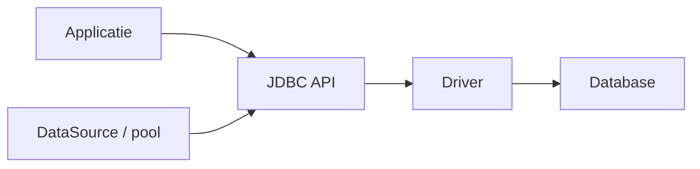
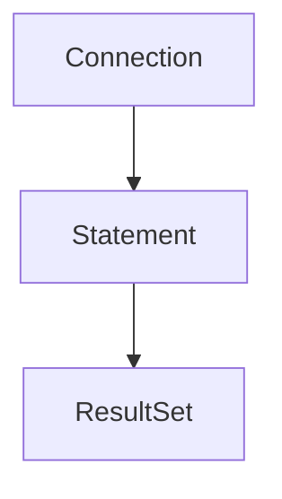

# 12 — Data, SQL en JDBC

[← Netwerk en security](../11-netwerk-security/README.md) ·
[Inhoudsopgave](../../INHOUDSOPGAVE.md) ·
[Testen →](../13-testen/README.md)

JDBC is de standaard Java-API voor relationele databases. Het abstraheert
verbindingen en statements, niet SQL-dialect, schemaontwerp of
transactiesemantiek.

## Architectuur



Voorkeur:

- `DataSource` boven rechtstreeks `DriverManager` in een applicatie;
- `PreparedStatement` boven SQL-concatenatie;
- try-with-resources voor connection/statement/resultset;
- expliciete transaction boundary in de use-case;
- databaseconstraints als laatste integriteitslinie.

## Basisquery

```java
public Optional<Klant> zoekKlant(DataSource dataSource, long id)
        throws SQLException {
    String sql = """
            SELECT id, naam, aangemaakt_op
            FROM klant
            WHERE id = ?
            """;

    try (Connection connection = dataSource.getConnection();
         PreparedStatement statement = connection.prepareStatement(sql)) {
        statement.setLong(1, id);

        try (ResultSet rs = statement.executeQuery()) {
            if (!rs.next()) {
                return Optional.empty();
            }
            return Optional.of(new Klant(
                    rs.getLong("id"),
                    rs.getString("naam"),
                    rs.getObject("aangemaakt_op", Instant.class)));
        }
    }
}
```

`executeQuery` is voor resultsets; `executeUpdate` retourneert affected rows;
`execute` behandelt algemene/multiple resultaten.

## Parameters en SQL-injectie

Fout:

```java
String sql = "SELECT * FROM klant WHERE naam = '" + userInput + "'";
```

Goed:

```java
PreparedStatement ps =
        connection.prepareStatement("SELECT * FROM klant WHERE naam = ?");
ps.setString(1, userInput);
```

Parameters zijn waarden, niet identifiers of SQL-fragmenten. Voor dynamische
kolommen/sorteervelden gebruik je een vaste allowlist en kiest de applicatie
een vooraf gedefinieerd fragment.

Een variabele `IN`-lijst vraagt evenveel placeholders als waarden of een
databasespecifieke array/tabletechniek. Begrens aantal parameters.

## SQL `NULL`

SQL `NULL` betekent onbekend/afwezig en gebruikt driewaardige logica:
`kolom = NULL` is niet waar; gebruik `IS NULL`.

Bij primitive getters kan `NULL` als nulwaarde verschijnen; controleer
`wasNull()` of gebruik geschikte objectmapping:

```java
Integer leeftijd = rs.getObject("leeftijd", Integer.class);
```

Maak de mapping tussen database-nullability en domeinmodel expliciet.

## Resources en streaming

De lifecycle is genest:



Sluiten van buitenliggende resource sluit doorgaans onderliggende resources,
maar gebruik duidelijke try-scopes. Een lazily teruggegeven `Stream<Row>` mag
niet verwijzen naar een connection die al gesloten is; modelleer ownership of
materialiseer binnen de boundary.

Grote resultaten:

- selecteer alleen nodige kolommen/rijen;
- gebruik pagination/cursor volgens consistentiesemantiek;
- configureer fetch size volgens driver;
- verwerk streaming;
- stel querytimeout en cancellation in;
- begrens geheugengebruik.

Offset pagination wordt traag/inconsistent bij grote veranderlijke datasets;
keyset pagination met stabiele unieke ordening is vaak beter.

## Transacties

```java
try (Connection connection = dataSource.getConnection()) {
    connection.setAutoCommit(false);
    try {
        boekDebet(connection, van, bedrag);
        boekCredit(connection, naar, bedrag);
        connection.commit();
    } catch (Exception e) {
        try {
            connection.rollback();
        } catch (SQLException rollbackFout) {
            e.addSuppressed(rollbackFout);
        }
        throw e;
    }
}
```

De transaction boundary hoort rond één consistente businessoperatie, niet
rond iedere repositorymethode afzonderlijk.

### ACID

| Eigenschap | Kernvraag |
|---|---|
| Atomicity | gebeurt alles of niets? |
| Consistency | behouden constraints/invarianten geldigheid? |
| Isolation | welke tussentoestanden zien transacties? |
| Durability | blijft een commit na failure bestaan volgens garantie? |

ACID maakt je businessinvariant niet automatisch correct; constraints en
transactielogica moeten die definiëren.

## Isolatieniveaus

JDBC-constanten: read uncommitted, read committed, repeatable read en
serializable. Werkelijk gedrag (MVCC, locks, write skew, gap locks) verschilt
per database.

Mogelijke anomalieën:

- dirty read;
- non-repeatable read;
- phantom;
- lost update;
- write skew.

Gebruik database-specifieke documentatie en concurrencytests. “Repeatable
read” is geen volledig portable gedragsbelofte boven de globale categorie.

Optimistic locking gebruikt vaak een versionkolom:

```sql
UPDATE bestelling
SET status = ?, versie = versie + 1
WHERE id = ? AND versie = ?
```

Affected rows `0` betekent conflict of ontbrekende rij; modelleer dat.

## Savepoints

Een savepoint laat binnen een transactie gedeeltelijk terugrollen:

```java
Savepoint punt = connection.setSavepoint();
try {
    optioneleStap(connection);
} catch (SQLException e) {
    connection.rollback(punt);
}
```

Gebruik dit niet om een te grote, onduidelijke transaction boundary te
maskeren.

## Batches en generated keys

```java
try (PreparedStatement ps = connection.prepareStatement(
        "INSERT INTO event(type, payload) VALUES (?, ?)")) {
    for (Event event : events) {
        ps.setString(1, event.type());
        ps.setString(2, event.payload());
        ps.addBatch();
    }
    int[] aantallen = ps.executeBatch();
}
```

Batchgedrag bij gedeeltelijke fout en generated keys is driver-/databasegevoelig.
Test failure semantics, transaction en limieten.

## Connection pools

Een JDBC-connection is kostbaar; een pool leent en reset connections.

Poolvragen:

- maximum/minimum en acquiretimeout;
- validatie en max lifetime;
- transaction/read-only/isolation reset;
- leak detection;
- metrics op actief, idle, waiters en acquirelatency;
- database connection budget over alle instances;
- graceful shutdown.

Meer threads dan databaseconnections geeft wachtrijen. Virtual threads maken
de database niet onbeperkt; begrens concurrentie bij de echte bottleneck.

## Mapping en repositories

Houd SQL zichtbaar genoeg om performance en semantics te beoordelen.
Een mapper vertaalt een rij naar een geldig domeinobject. Een repository
verbergt opslagdetails, niet alle database-realiteit.

Vermijd:

- N+1-querypatroon;
- `SELECT *`;
- domeinobjecten halfinitialiseren;
- één god-repository;
- transaction boundaries in willekeurige lage methoden;
- lazy data buiten connectionlifecycle.

## Schema en migraties

Schemawijzigingen horen:

- versioned en herhaalbaar gedeployed;
- backward compatible tijdens rolling deploy;
- eerst expand, dan applicatiemigratie/backfill, dan contract;
- getest op dataomvang, locks en duur;
- voorzien van observability en herstelplan.

Databaseconstraints (`NOT NULL`, `UNIQUE`, FK, CHECK) beschermen alle writers,
niet alleen Java-code.

## Tijd en types

Gebruik JDBC 4.2-mapping voor `java.time` waar driver/database ondersteunen.
Leg vast of een kolom een instant, lokale kalenderwaarde of offset representeert.
Database “timestamp”-types verschillen sterk.

Voor geld: database `DECIMAL/NUMERIC` ↔ `BigDecimal`, met expliciete precision,
scale en afronding. Voor blobs/clobs: stream en begrens.

## Foutafhandeling en retries

`SQLException` bevat SQLState, vendorcode, message en chain. Vertaal naar
betekenisvolle opslag-/domeinfouten zonder bewijs te verliezen.

Retry alleen wanneer:

- fout aantoonbaar transient is;
- operatie idempotent is of transactioneel veilig opnieuw kan;
- poging begrensd is met backoff/jitter;
- deadline behouden blijft;
- metrics dubbele pogingen zichtbaar maken.

Een verloren connection na commit kan een “unknown outcome” geven. Blind
opnieuw uitvoeren kan dupliceren; ontwerp idempotency.

## Checklist

- [ ] Ik gebruik `DataSource`, prepared statements en try-with-resources.
- [ ] Dynamische SQL-structuur komt uit een allowlist, waarden uit parameters.
- [ ] Ik modelleer SQL NULL en Java-nullability expliciet.
- [ ] Transaction boundaries volgen businessoperaties.
- [ ] Ik begrijp isolatie als database-specifiek concreet gedrag.
- [ ] Poolgrootte volgt het totale databasebudget en heeft metrics/timeouts.
- [ ] Mapping, pagination, batching en migraties zijn getest op echte schaal.
- [ ] Retries zijn begrensd, geobserveerd en idempotent.

## Verder

- [Testen](../13-testen/README.md)
- [Ontwerp en architectuur](../15-architectuur/README.md)
- [Netwerk en security](../11-netwerk-security/README.md)
