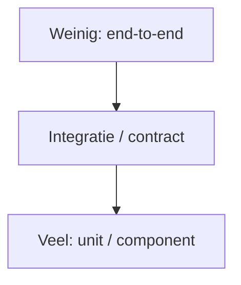

# 13 — Testen

[← Data en JDBC](../12-data-jdbc/README.md) ·
[Inhoudsopgave](../../INHOUDSOPGAVE.md) ·
[Build en tooling →](../14-build-tooling/README.md)

Een test is uitvoerbaar bewijs van één eigenschap onder expliciete condities.
Veel tests zijn niet hetzelfde als veel vertrouwen; kies risico's, grenzen en
observaties bewust.

## Testniveaus



| Niveau | Grens | Sterkte | Zwakte |
|---|---|---|---|
| unit | kleine logische eenheid | snel, precieze feedback | kan integratiefout missen |
| component | module/use-case met fakes | realistisch ontwerpcontract | meer setup |
| integratie | echte DB/filesystem/netwerkdeel | compatibiliteit | trager/omgeving |
| contract | producer-consumerafspraak | grenscompatibiliteit | geen volledige workflow |
| end-to-end | hele gedeployde keten | gebruikerspad | duur, lastig diagnosticeren |

De piramide is een heuristiek. Een data-intensieve applicatie kan relatief meer
integratietests nodig hebben; houd snelle, lokale feedback.

## Testbare code

Testbaarheid volgt meestal uit goed ontwerp:

- pure logica gescheiden van I/O;
- tijd via `Clock`;
- randombron injecteerbaar;
- dependencies via constructor;
- kleine expliciete boundaries;
- geen verborgen globale mutable state;
- deterministische fout- en concurrencycontracten.

```java
public final class AbonnementService {
    private final Clock klok;

    public AbonnementService(Clock klok) {
        this.klok = klok;
    }

    boolean isVerlopen(Abonnement abonnement) {
        return abonnement.einddatum()
                .isBefore(LocalDate.now(klok));
    }
}
```

## JUnit-platform

JUnit 6 is de actuele generatie. De kernarchitectuur:

- **JUnit Platform**: discovery en launching;
- **JUnit Jupiter**: moderne programmeer- en extensionmodel;
- **Vintage**: legacy JUnit 3/4-tests indien apart toegevoegd.

Basis:

```java
import static org.junit.jupiter.api.Assertions.*;

class GeldTest {
    @Test
    void teltBedragenMetDezelfdeValutaOp() {
        Geld links = Geld.euro("10.00");
        Geld rechts = Geld.euro("2.50");

        Geld resultaat = links.plus(rechts);

        assertEquals(Geld.euro("12.50"), resultaat);
    }
}
```

De testnaam beschrijft gedrag. Arrange–Act–Assert is een leespatroon, geen
verplichte commentsjabloon.

## Assertions

```java
assertAll(
        () -> assertEquals("Ada", klant.naam()),
        () -> assertTrue(klant.actief()));

IllegalArgumentException fout = assertThrows(
        IllegalArgumentException.class,
        () -> Geld.euro("-1.00"));
assertEquals("Bedrag moet niet-negatief zijn", fout.getMessage());

assertTimeout(Duration.ofMillis(100), () -> bereken());
```

Gebruik exacte assertions voor exacte contracten en domeinspecifieke helpers
voor complexe objecten. Een exceptiontype en relevante context zijn nuttiger
dan alleen “er kwam iets”.

`assertTimeoutPreemptively` draait code op een andere thread en kan threadlocal,
transaction of interruptionsemantiek veranderen; gebruik bewust.

## Lifecycle en isolatie

`@BeforeEach`, `@AfterEach`, `@BeforeAll`, `@AfterAll` beheren fixtures.
Iedere test hoort zelfstandig te draaien:

- geen afhankelijkheid van volgorde;
- geen achtergebleven globale state;
- unieke testdata;
- tijdelijke directories via `@TempDir`;
- resources altijd sluiten;
- parallelle uitvoering alleen bij thread-safe fixtures.

Vermijd een enorme shared setup die de betekenis van elke test verbergt.

## Parameterized tests

```java
@ParameterizedTest
@CsvSource({
        "0, gratis",
        "1, betaald",
        "100, betaald"
})
void classificeertPrijs(String bedrag, String verwacht) {
    assertEquals(
            verwacht,
            classificeer(new BigDecimal(bedrag)));
}
```

Bronnen: `@ValueSource`, `@CsvSource`, `@CsvFileSource`, `@EnumSource`,
`@MethodSource`, `@ArgumentsSource`.

Parameterized tests zijn sterk voor gelijkvormige grensgevallen; maak geen
onleesbare spreadsheet van uiteenlopende scenario's.

## Test doubles

| Double | Gedrag |
|---|---|
| dummy | alleen om parameter te vullen |
| stub | geeft geprogrammeerde antwoorden |
| fake | werkende vereenvoudigde implementatie |
| spy | registreert calls naast echt/gesimuleerd gedrag |
| mock | interactieverwachtingen |

Een handgeschreven fake op een stabiele interface:

```java
final class InMemoryKlantRepository implements KlantRepository {
    private final Map<KlantId, Klant> data = new HashMap<>();

    @Override
    public Optional<Klant> zoek(KlantId id) {
        return Optional.ofNullable(data.get(id));
    }
}
```

Mocks zijn nuttig om een relevante uitgaande interactie te bewijzen
(bijvoorbeeld exact één betaalopdracht). Overmatig interne calls verifiëren
maakt tests gekoppeld aan implementatie en belemmert refactoring.

Mock geen value objects of simpele collections. Mock geen API die je niet
bezit zonder adapter/contracttest.

## Integratietests

Een database-integratietest hoort:

- echte migrations/schema te gebruiken;
- dezelfde database-engine/major te benaderen;
- transaction/isolation/constraints te testen;
- data per test te isoleren;
- cleanup en parallelisme te beheersen;
- failure- en timeoutpaden mee te nemen.

Een in-memory database met ander dialect is geen bewijs voor productie-SQL.
Testcontainers of een beheerde tijdelijke database kan realistischer zijn,
maar blijft infrastructuur met startup- en resourcekosten.

Filesystemtests gebruiken een echte tijdelijke directory. HTTP-contracten
kunnen met een lokale testserver worden getest; reserveer end-to-end voor
kritieke paden.

## Property-based testing

In plaats van voorbeelden definieer je eigenschappen over veel gegenereerde
inputs:

- sorteren behoudt multiset en levert geordende output;
- encode/decode is een round trip;
- `plus` is associatief waar het domein dat garandeert;
- parser faalt gecontroleerd op begrensde willekeurige input.

Goede generators respecteren of bewust verbreken domeinconstraints. Shrinking
maakt een falend geval minimaal.

## Mutation testing

Een mutation tool verandert operators/branches in productiecode. Als tests
blijven slagen, detecteren ze die gedragsverandering niet. Mutation score is
een signaal voor assertionkwaliteit, geen doel om automatisch 100% te halen.

## Coverage

Line/branch coverage vertelt wat tijdens tests geraakt is, niet wat bewezen is.
Gebruik het om blinde vlekken te vinden:

- belangrijke foutpaden;
- boundaries;
- branches;
- concurrency-/resourcecleanup.

Uitsluiten van generated/trivial code kan rapporten bruikbaarder maken, maar
verberg geen complexe code om een percentage te verbeteren.

## Concurrencytests

- Gebruik latches/barriers voor gecontroleerde interleavings.
- Geef iedere wait een timeout.
- Herhaal stressscenario's, maar accepteer “1000 keer groen” niet als formeel bewijs.
- Test cancellation en interruptstatus.
- Gebruik gespecialiseerde tools/libraries voor JMM-litmustests.
- Inspecteer productiegedrag met JFR en invariants.

`Thread.sleep` alleen gebruiken als de tijd zelf onderdeel van het gedrag is,
niet als synchronisatie.

## Performancetests

Microbenchmarks: JMH. Loadtests: realistische serviceworkload. Regressietests:
stabiele omgeving en statistiek.

Meet:

- distributies/p50/p95/p99, niet alleen gemiddelde;
- throughput en concurrency;
- CPU, allocation en GC;
- warm-up/startup apart;
- dataomvang en cachetoestand;
- foutpercentage en saturation.

## Flaky tests

Classificeer oorzaak:

- tijd/klok;
- race/volgorde;
- gedeelde state;
- netwerk/extern systeem;
- willekeur zonder seed;
- poort/bestand/resource;
- te krappe timeout;
- afhankelijkheid van locale/zone/charset.

Quarantine kan tijdelijk zichtbaarheid behouden, maar is geen eindoplossing.
Log seed, timing en omgeving om reproduceerbaarheid te verbeteren.

## Wat test je niet?

Test niet blind:

- Java-librarycontracten zelf;
- private methoden rechtstreeks;
- trivial getters zonder gedrag;
- implementatiedetails die geen observeerbaar contract vormen.

Test je configuratie en integratie wél wanneer verkeerd gebruik van zo'n
librarycontract risico geeft.

## Checklist

- [ ] Iedere test noemt een observeerbaar gedrag en relevante conditie.
- [ ] Unitlogica is snel/deterministisch; grenzen hebben realistische tests.
- [ ] Tijd, random en dependencies zijn controleerbaar.
- [ ] Doubles vervangen alleen echte boundaries en niet het domein.
- [ ] Exceptions, resources, transacties en cancellation hebben fouttests.
- [ ] Coverage en mutation zijn diagnostiek, geen vanity metric.
- [ ] Flaky tests worden geclassificeerd en gerepareerd.

## Verder

- [Build en tooling](../14-build-tooling/README.md)
- [Praktijk](../18-praktijk/README.md)
- [JUnit User Guide][junit]

[junit]: https://docs.junit.org/6.1.2/
