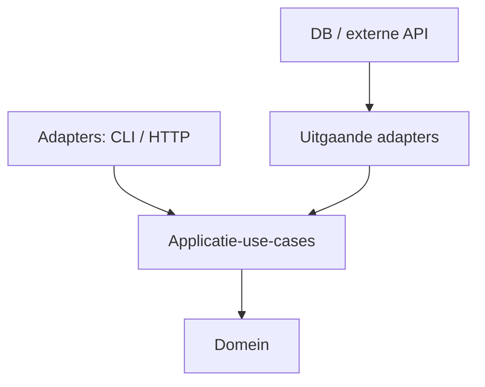

# 15 — Ontwerp en architectuur

[← Build en tooling](../14-build-tooling/README.md) ·
[Inhoudsopgave](../../INHOUDSOPGAVE.md) ·
[Modern Java →](../16-modern-java/README.md)

Architectuur is het beheren van verandering, risico en grenzen. Patronen en
principes zijn vocabulaire voor trade-offs, geen scorekaart.

## Cohesie, coupling en informatie

- **Hoge cohesie**: dingen die om dezelfde reden veranderen staan samen.
- **Lage coupling**: een module kent zo weinig mogelijk instabiele details.
- **Encapsulatie**: beslissingen blijven achter een boundary.
- **Dependency direction**: stabiele businessregels kennen infrastructuur niet.



Pijlen tonen broncodedependency richting binnen. Runtimecalls kunnen in beide
richtingen via interfaces lopen.

## SOLID als vragen

| Principe | Reviewvraag |
|---|---|
| SRP | Welke actor/redenen laten dit type veranderen? |
| OCP | Kan nieuw gedrag via een ontworpen extensiepunt zonder kernwijziging? |
| LSP | Kan ieder subtype het volledige supertypecontract waarmaken? |
| ISP | Moet een consumer afhangen van methoden die hij niet gebruikt? |
| DIP | Kent businesscode concrete I/O-details of een eigen abstractie? |

“Iedere class één methode” is geen SRP. Te veel interfaces zonder variatiepunt
is geen DIP.

## Domeinmodellering

### Entity versus value object

- Entity: continuïteit door identiteit, state kan veranderen.
- Value object: gelijkheid door waarde, liefst immutable.

```java
record KlantId(UUID waarde) {
    KlantId {
        Objects.requireNonNull(waarde);
    }
}

record EmailAdres(String waarde) {
    EmailAdres {
        if (!isGeldig(waarde)) {
            throw new IllegalArgumentException("Ongeldig e-mailadres");
        }
    }
}
```

Primitive obsession (`String`, `long`, `Map<String,Object>` voor alles)
verliest units, validatie en betekenis.

### Aggregate en invariant

Een aggregate bewaakt een consistency boundary. Externe code muteert internals
niet rechtstreeks; wijzigingen gaan via gedrag op de root. Maak aggregates
niet groter dan de invariant werkelijk vraagt.

Database-transactiongrens en aggregategrens zijn vaak gerelateerd, maar niet
automatisch identiek in ieder systeem.

## Immutability

Voordelen:

- lokaal redeneren;
- veilige deling;
- stabiele hash/equality;
- eenvoudige rollback/snapshots;
- minder aliasing.

Immutability kan extra allocaties of kopieën geven. Persistent datastructures,
copy-on-write of ownership kunnen alternatieven zijn. Maak mutatie lokaal en
expliciet.

## Fouten modelleren

Kies per grens:

- waardevariant (`Resultaat`, sealed hierarchy) voor verwacht domeinresultaat;
- exception voor abrupte mislukking/contract;
- lege collectie/`Optional` voor normale afwezigheid;
- statusobject met details voor batchdeelsucces.

Vermijd booleanresultaten die foutreden verliezen. Vertaal technische fouten
naar domein-/use-casebetekenis op de boundary en bewaar cause voor diagnose.

## Creational patterns

| Patroon | Past wanneer | Valkuil |
|---|---|---|
| static factory | betekenisvolle creatie/implementatiekeuze | verborgen discovery |
| builder | veel optionele waarden/stapsgewijze validatie | boilerplate voor simpele waarde |
| factory method | subclasses bepalen product | overerving als verkeerde extensie |
| abstract factory | families compatibele objecten | te brede fabriek |
| prototype/copy | nieuwe waarde uit bestaande | shallow/deep copy onduidelijk |

Singleton is globale lifecycle/state. Een enum-singleton kan technisch veilig
zijn, maar testisolatie en dependencyzichtbaarheid blijven ontwerpvragen.

## Structural patterns

| Patroon | Intentie |
|---|---|
| adapter | één interface naar een andere vertalen |
| decorator | gedrag rondom hetzelfde contract toevoegen |
| facade | eenvoudige ingang tot complex subsysteem |
| composite | boom van deel/geheel uniform behandelen |
| proxy | toegang/lifecycle/remote/lazy grens beheren |
| bridge | twee variatieassen los evolueren |

Een wrapper is niet automatisch een decorator; het contract en substitutie
bepalen het patroon.

## Behavioral patterns

| Patroon | Intentie |
|---|---|
| strategy | algoritme uitwisselbaar maken |
| command | verzoek als waarde modelleren |
| observer | subscribers op events informeren |
| state | gedrag laten volgen uit expliciete toestand |
| template method | algoritmeskelet met hooks |
| chain of responsibility | verzoek door handlers leiden |
| iterator | traversal los van representatie |
| visitor | operatie over gesloten typefamilie |

Lambdas maken strategy/command compact. Sealed types en pattern matching maken
gesloten state/visitorachtige verwerking expliciet.

## Dependency injection zonder framework

Constructorinjectie:

```java
public final class PlaatsBestelling {
    private final BestellingRepository repository;
    private final BetaalPoort betalen;
    private final Clock klok;

    public PlaatsBestelling(
            BestellingRepository repository,
            BetaalPoort betalen,
            Clock klok) {
        this.repository = Objects.requireNonNull(repository);
        this.betalen = Objects.requireNonNull(betalen);
        this.klok = Objects.requireNonNull(klok);
    }
}
```

Een composition root maakt concrete objecten:

```java
public static void main(String[] args) {
    var repository = new JdbcBestellingRepository(dataSource());
    var betalen = new HttpBetaalPoort(httpClient());
    var useCase = new PlaatsBestelling(repository, betalen, Clock.systemUTC());
    startCli(useCase);
}
```

Dependencies zijn zichtbaar, non-null en testbaar. Service locator/globale
registry verbergt ze.

## Layers versus hexagonal

Klassieke lagen kunnen goed werken als dependencies naar binnen wijzen.
Hexagonal/ports-and-adapters benoemt de businessboundary expliciet:

- inbound port: wat de applicatie kan;
- inbound adapter: CLI/HTTP/message consumer;
- outbound port: wat de applicatie nodig heeft;
- outbound adapter: JDBC/HTTP/filesystem.

Maak niet voor elk klein project vijf modules. Voeg grenzen toe waar
veranderlijkheid, teamownership, security of testbaarheid ze rechtvaardigt.

## Events

Een domain event zegt wat in het domein gebeurd is. Een integration event is
een versioned contract naar buiten.

Bij database + broker ontstaat dual-writeproblematiek. Patronen zoals
transactional outbox kunnen at-least-once levering ondersteunen, maar consumers
moeten idempotent zijn en ordering/sleutelbeleid kennen.

“Exactly once” is altijd beperkt tot een gedefinieerde grens en protocol.

## API-ontwerp

Een goede Java-API:

- heeft klein coherent publiek oppervlak;
- gebruikt domeintypes en duidelijke units;
- specificeert nullability, mutability, ownership en thread-safety;
- geeft geen wijzigbare internals terug;
- heeft voorspelbare exceptions;
- vermijdt boolean-/nullambiguïteit;
- is moeilijk verkeerd te gebruiken;
- evolueert compatibel.

Overloads met dezelfde arity en functionele interfaces kunnen lambda-ambiguïteit
veroorzaken. Varargs en generics kunnen warnings/heap pollution creëren.

### Binaire evolutie

Voor publieke libraries: test consumercompilatie en bestaande binaries. Het
toevoegen van een abstracte interfacemethode breekt implementaties; een
defaultmethode kan compatibeler zijn maar semantische conflicten geven.

## Package- en modulegrenzen

Package by feature houdt use-casegerelateerde code bijeen. Package by
technische laag kan cross-featurewijzigingen verspreiden. Een pragmatische
structuur:

```text
bestelling/
  api/
  application/
  domain/
  adapter/jdbc/
  adapter/http/
```

Maak internals package-private waar mogelijk. Een Java-module kan publieke
packages verder beperken via `exports`.

## Clean code zonder dogma

- Namen dragen domeinbetekenis.
- Methoden hebben één begrijpelijk abstractieniveau.
- Side effects zijn zichtbaar.
- Comments verklaren waarom/contract.
- Duplicatie is soms goedkoper dan de verkeerde abstractie.
- Een lange methode is een signaal, niet automatisch een bug.
- Performancecritical code mag anders gevormd zijn, met bewijs en uitleg.

## Beslissen en documenteren

Leg belangrijke keuzes vast in een korte Architecture Decision Record:

```text
Titel en status
Context en krachten
Besluit
Alternatieven
Gevolgen en herzieningssignaal
```

Een beslissing zonder gevolg/trade-off is reclame, geen architectuur.

## Veelgemaakte fouten

- Patronen toevoegen voordat variatie bestaat.
- Interfaces één-op-één rond elke class zetten.
- “Clean” lagen met alleen doorgeefmethoden.
- Businessregels in controllers, SQL-mappers of loggingcallbacks.
- Globale service locator.
- Eventual consistency introduceren zonder productsemantiek.
- Publieke API laten lekken door infrastructuurtypes.
- Distributed system kiezen om lokale modulariteit te vermijden.

## Checklist

- [ ] Cohesie, coupling en dependencyrichting zijn bewust.
- [ ] Domeintypes bewaken invarianten en units.
- [ ] Patronen lossen een benoemd variatie-/lifecycleprobleem op.
- [ ] Composition root en boundaries maken dependencies zichtbaar.
- [ ] Events hebben delivery-, ordering-, version- en idempotencycontract.
- [ ] Publieke API specificeert nullability, ownership en thread-safety.
- [ ] Belangrijke trade-offs hebben een herzieningssignaal.

## Verder

- [Modern Java](../16-modern-java/README.md)
- [Expertpraktijk](../17-expert/README.md)
- [Praktijk](../18-praktijk/README.md)
