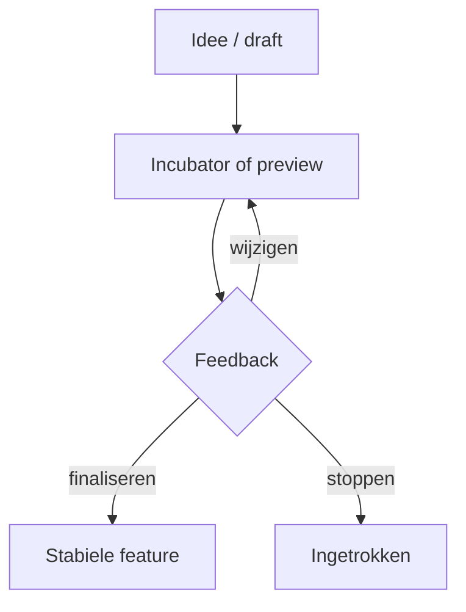

# 16 — Modern Java: 8 tot en met 26

[← Ontwerp en architectuur](../15-architectuur/README.md) ·
[Inhoudsopgave](../../INHOUDSOPGAVE.md) ·
[Expertpraktijk →](../17-expert/README.md)

Modern Java is geen lijst syntaxtrucs. De taal evolueert in samenhang met de
JVM, libraries, tooling en migratiegaranties.

## Releasemodel

Sinds Java 10 verschijnt ongeveer iedere zes maanden een feature release.
Oracle markeert Java 8, 11, 17, 21 en 25 als LTS; LTS is een supportbeleid van
een leverancier/distributie, niet een ander taaltype.

Op 30 juli 2026:

- Java 25 is de actuele LTS-basis van dit handboek;
- Java 26 is de actuele feature release;
- Java 27 is gepland voor september 2026 en dus nog geen stabiele basis.

Controleer altijd de [supportroadmap][roadmap] en distributievoorwaarden.

## Tijdlijn

De tabel noemt bepalende highlights, niet iedere JEP of API-wijziging.

| Java | Belangrijke definitieve toevoegingen / mijlpalen |
|---:|---|
| 8 | lambdas, streams, default methods, `Optional`, `java.time`, `CompletableFuture` |
| 9 | JPMS/modules, JShell, collection factories, `Flow`, private interfacemethoden |
| 10 | lokale type-inferentie met `var`, application CDS |
| 11 LTS | standaard HTTP Client, single-file source launch, `var` in lambdaparameters |
| 12 | compacte number formatting; switch expressions als preview |
| 13 | dynamische CDS; text blocks als preview |
| 14 | switch expressions final, nuttigere NPE's; records/pattern `instanceof` preview |
| 15 | text blocks final, hidden classes; sealed classes preview |
| 16 | records en pattern matching voor `instanceof` final, `jpackage` |
| 17 LTS | sealed classes final, enhanced random generators; pattern switch preview |
| 18 | UTF-8 als default charset, simple web server, Javadoc code snippets |
| 19 | virtual threads, record patterns en structured concurrency als preview |
| 20 | scoped values als incubator; verdere previews voor patterns/virtual threads |
| 21 LTS | virtual threads, record patterns en pattern switch final; sequenced collections |
| 22 | Foreign Function & Memory API en unnamed variables/patterns final |
| 23 | Markdown-documentatiecomments; verdere previews voor primitive patterns/modules |
| 24 | Class-File API en Stream Gatherers final; synchronisatie pinnt virtual threads minder |
| 25 LTS | module imports, compact source files, flexible constructor bodies en scoped values final |
| 26 | HTTP/3 in HTTP Client, Applet API verwijderd, uitgebreid AOT-objectcaching |

Lees per release de officiële projectpagina; previews kunnen tussen rondes
wezenlijk veranderen of worden ingetrokken.

## `var`

```java
var klanten = new ArrayList<Klant>();
var resultaat = service.verwerk(verzoek);
```

Gebruik als initializer het type duidelijk maakt. Vermijd:

```java
var x = factory.create(); // betekenis en type onzichtbaar
```

`var` maakt Java niet dynamisch en werkt niet voor fields, returntypes of
parameterdeclaraties (behalve syntactisch bij lambdaparameters).

## Switch expressions en patterns

```java
static BigDecimal oppervlakte(Vorm vorm) {
    return switch (vorm) {
        case Cirkel(var straal) ->
                BigDecimal.valueOf(Math.PI * straal * straal);
        case Rechthoek(var breedte, var hoogte) ->
                BigDecimal.valueOf(breedte * hoogte);
    };
}
```

Record patterns deconstrueren data; guards (`when`) verfijnen een case.
Dominantie en exhaustiveness worden compile-time gecontroleerd. Modelleer een
gesloten familie met sealed types als een exhaustive switch betekenisvol is.

Pattern matching maakt typecases leesbaar, maar een grote switch over een open
hiërarchie kan wijzen op ontbrekend polymorfisme.

## Records

Records zijn nominale tuples met expliciete API/validatie. Ze ondersteunen:

- compacte/canonieke constructors;
- interfaces;
- static members;
- annotations op componenten;
- generic typeparameters;
- lokale records.

Niet:

- extends van eigen class;
- extra instancevelden;
- setters op final componentfields.

Gebruik defensieve kopieën voor mutable componenten:

```java
record Team(List<String> leden) {
    Team {
        leden = List.copyOf(leden);
    }
}
```

## Sealed types

Sealed hiërarchieën geven controle over directe subtypes. Dit helpt:

- domeinvarianten met bekende varianten;
- compiler-exhaustiveness;
- veilige evolutie binnen module/package.

Het toevoegen van een permitted subtype kan downstream exhaustive switches
broncompatibiliteit laten verliezen. Behandel het als API-evolutie.

## Compacte bronbestanden en instance `main`

Java 25 finaliseert compacte source files en instance main methods om kleine
programma's zonder ceremonie te schrijven. Dit verlaagt de instap, maar
packages/classes/modules blijven essentieel zodra software groeit.

Voorbeeldconcept:

```java
void main() {
    IO.println("Hallo, Java!");
}
```

De exacte implicit imports/regels zijn releasegebonden. Gebruik de
JDK 25-taaldocumentatie en compileer met een passend `--release`.

## Module import declarations

```java
import module java.base;
```

Dit importeert on demand publieke top-level types uit exported packages van
een module. Het verandert module-readability niet en kan naamambiguïteit geven.
In productcode blijven gerichte imports vaak duidelijker; voor compacte
leer-/dataprogramma's kan module-import ceremonie verminderen.

## Flexible constructor bodies

Java 25 staat statements toe vóór een expliciete `super(...)`/`this(...)`,
zolang de nog niet geïnitialiseerde instance niet onveilig wordt gebruikt.
Dit maakt argumentvalidatie/-berekening vóór superconstructor mogelijk:

```java
Vierkant(double zijde) {
    if (zijde <= 0) {
        throw new IllegalArgumentException("zijde");
    }
    super(zijde, zijde);
}
```

De compiler bewaakt de vroege constructiecontext; het object is pas volledig
bruikbaar na de constructorchain.

## Virtual threads en scoped values

Virtual threads (Java 21) maken de eenvoudige blocking stijl schaalbaar voor
veel I/O. Scoped values (final in Java 25) delen immutable context binnen een
begrensde calltree. Zie [Concurrency](../08-concurrency/README.md).

Structured concurrency blijft in Java 25 preview. Zet previewafhankelijkheid
expliciet in build, runtime en releasebeleid.

## Foreign Function & Memory API

Sinds Java 22 biedt FFM een standaardmanier voor:

- off-heap memorysegmenten;
- gecontroleerde lifetime via arenas;
- layouts en var handles;
- native functions via linker/method handles.

```java
try (Arena arena = Arena.ofConfined()) {
    MemorySegment segment = arena.allocate(ValueLayout.JAVA_INT);
    segment.set(ValueLayout.JAVA_INT, 0, 42);
    int waarde = segment.get(ValueLayout.JAVA_INT, 0);
}
```

Restricted operations/native calls vereisen passend runtimebeleid. Verkeerde
layouts, ownership of concurrency kunnen alsnog memorycorruptie/native crashes
geven. FFM is veiliger gestructureerd dan ruwe JNI, niet automatisch veilig
ongeacht gebruik.

## Class-File API en Stream Gatherers

De Class-File API (final in Java 24) modelleert classfiles voor parsing,
generatie en transformatie.

Stream Gatherers (final in Java 24) maken custom intermediate streamoperaties
mogelijk, bijvoorbeeld vaste windows of stateful transformaties, zonder de
Stream API zelf te veranderen. Schrijf pas een custom gatherer als bestaande
operations/collector/lus niet duidelijk volstaan; test sequential/parallel
semantics.

## Java 25-highlights

Definitief:

- JEP 506 — Scoped Values;
- JEP 511 — Module Import Declarations;
- JEP 512 — Compact Source Files and Instance Main Methods;
- JEP 513 — Flexible Constructor Bodies;
- compact object headers en meerdere JFR/AOT-verbeteringen in HotSpot/tooling.

Nog niet als stabiele basis behandelen:

- Stable Values (preview);
- Structured Concurrency (preview);
- primitive types in patterns (preview);
- Vector API (incubator).

Lees de exacte status op de [JDK 25-projectpagina][jdk25].

## Java 26-highlights

Java 26 is niet-LTS. Belangrijke definitieve platformwijzigingen:

- JEP 504 — Applet API verwijderd;
- JEP 516 — ahead-of-time object caching met iedere GC;
- JEP 517 — HTTP/3 voor de HTTP Client API;
- voorbereiding om `final` streng als werkelijk final te handhaven.

Gebruik de [JDK 26-projectpagina][jdk26] voor de volledige lijst en
previewstatussen.

## Preview- en incubatorbeleid



Voor productiegebruik van preview:

1. concrete waarde en alternatief documenteren;
2. build én runtime met `--enable-preview`;
3. exact JDK-releasenummer pinnen;
4. migratiebudget voor iedere feature release;
5. serialized/classfile/public API niet ongemerkt laten lekken;
6. rollbackpad.

## Migreren

1. Upgrade eerst naar de laatste patch van huidige major.
2. Maak warnings/deprecations zichtbaar.
3. Update buildtool/plugins/dependencies.
4. Compileer en test op doel-JDK, eventueel runtime eerst apart.
5. Controleer verwijderde Java EE/CORBA-modules en internals sinds 9+.
6. Gebruik `jdeps`, `jdeprscan` en release notes.
7. Meet startup, memory, GC en latency.
8. Migreer syntax/features daarna in kleine refactors.

Test:

- broncompile;
- bestaande binaries/plugins;
- reflectie/modules;
- serialisatie/wireformats;
- locale/charset/tijd;
- performance en resourcegrenzen.

## Checklist

- [ ] Ik weet welke gebruikte features final, preview of incubator zijn.
- [ ] Ik kan records/sealed/patterns inzetten als domeinmodel.
- [ ] Ik gebruik virtual threads en scoped values volgens hun echte contract.
- [ ] Ik ken de rol van FFM, Class-File API en Gatherers.
- [ ] Mijn migratie scheidt runtime-, build-, source- en featureverandering.
- [ ] Ik baseer releasestatus op OpenJDK/JEP's, niet op blogs.

## Verder

- [Versiebeleid](../../VERSIES.md)
- [JDK 25 features][jdk25]
- [JDK 26 features][jdk26]
- [Expertpraktijk](../17-expert/README.md)

[roadmap]: https://www.oracle.com/java/technologies/java-se-support-roadmap.html
[jdk25]: https://openjdk.org/projects/jdk/25/
[jdk26]: https://openjdk.org/projects/jdk/26/
