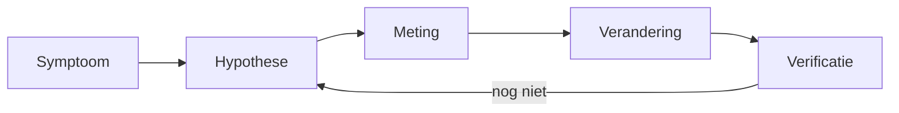

# 17 — Expertpraktijk

[← Modern Java](../16-modern-java/README.md) ·
[Inhoudsopgave](../../INHOUDSOPGAVE.md) ·
[Praktijk →](../18-praktijk/README.md)

Expertise is niet zoveel mogelijk JVM-flags kennen. Het is onder onzekerheid
een reproduceerbaar bewijs opbouwen, risico begrenzen en de eenvoudigste
effectieve verandering kiezen.

## Diagnose als wetenschappelijke cyclus



Maak vóór een verandering duidelijk:

- welk gebruikers-/SLO-symptoom;
- tijdvenster en getroffen scope;
- recente veranderingen;
- verwachte signature als hypothese klopt;
- veilige meetmethode;
- rollback en succescriterium.

Bewaar bewijs met klok, versie, configuratie en workload.

## Latency als wachtrijprobleem

Little's Law in stabiele toestand:

$$L = \lambda W$$

- $L$: gemiddeld aantal items in systeem;
- $\lambda$: gemiddelde arrival rate;
- $W$: gemiddelde tijd in systeem.

Als arrival rate capaciteit nadert, groeien queues en tail latency sterk.
Meer threads kunnen contention en downstreamoverload vergroten.

Meet per resource:

- vraag/arrival rate;
- actieve concurrency;
- queue/wachttijd;
- service time;
- errors/timeouts;
- saturation (CPU, connections, disk, remote quota).

## USE en RED

**USE** voor resources:

- Utilization;
- Saturation;
- Errors.

**RED** voor services:

- Rate;
- Errors;
- Duration.

Koppel JVM-events aan host-, container-, database- en requestmetrics.

## JFR-first diagnose

Java Flight Recorder heeft lage overheadprofielen voor brede evidence:

```bash
jcmd <pid> JFR.start name=onderzoek settings=profile duration=120s \
  filename=onderzoek.jfr
```

Bekijk:

- execution samples/CPU;
- allocations;
- GC pauses/cycles;
- monitor enter/thread park;
- socket/file I/O;
- exceptions;
- classloading;
- virtual-thread pinning/submit failures waar beschikbaar.

Één profiel is een steekproef. Vergelijk goed/slecht tijdvenster en corrigeer
voor workload.

## CPU-diagnose

1. Bevestig proces/container-CPU versus throttling.
2. Neem tijdgebonden samples.
3. Bekijk call tree en hot path, niet alleen leaf.
4. Controleer locks, spin, serialisatie, regex, crypto en logging.
5. Formuleer verandering op algoritme/dataflow.
6. Verifieer CPU én latency/allocatiecorrectheid.

Samplingprofielen hebben statistische bias. Instrumentatie kan gedrag sterker
veranderen. Combineer methodes indien de beslissing groot is.

## Allocatie en retentie

- Allocation profile: waar objecten worden gemaakt.
- Heap histogram: welke classes nu veel instances/bytes hebben.
- Heap dump: wie houdt objecten via welk GC-rootpad vast.
- Native Memory Tracking: JVM-native categorieën, indien vooraf passend geactiveerd.
- OS-tools: volledig RSS/mappings.

Een top-allocator is niet noodzakelijk het lek. Een top-retainer is niet
noodzakelijk de oorsprong. Zoek ownership/lifecycle.

## Thread- en lockanalyse

Neem meerdere thread dumps met interval. Eén dump toont toestand, geen trend.

Zoek:

- deadlockdetectie;
- veel threads op dezelfde monitor/lock;
- poolworkers wachtend en queuegroei;
- blocked I/O zonder timeout;
- common-poolstarvation;
- threadlocal/classloaderretentie;
- platformthreadexplosie;
- virtual-thread pinning.

Een `WAITING` thread is vaak gezond. Context en capaciteit bepalen het.

## JMH-microbenchmarks

JMH beheert forks, warm-up, metingen en anti-optimalisatietechnieken.

```java
@State(Scope.Thread)
public class ZoekBenchmark {
    private List<Integer> lijst;

    @Setup
    public void setup() {
        lijst = IntStream.range(0, 10_000).boxed().toList();
    }

    @Benchmark
    public boolean bevat(Blackhole blackhole) {
        boolean resultaat = lijst.contains(9_999);
        blackhole.consume(resultaat);
        return resultaat;
    }
}
```

Checklist:

- meerdere forks (nieuw JVM-proces);
- voldoende warm-up/measurement;
- resultaat consumeren;
- setup buiten gemeten pad tenzij bewust;
- inputvariatie tegen constant folding;
- realistische data en concurrency;
- GC/allocationprofiler;
- confidence/error bars;
- geen nanosecondeclaim uit laptopruis;
- macrobenchmark bevestigt gebruikersimpact.

JMH maakt een irrelevante vraag niet relevant.

## Performancebudget

Definieer per critical path:

| Dimensie | Voorbeeld |
|---|---|
| latency | p99 < 200 ms bij X RPS |
| throughput | ≥ 5.000 events/s |
| allocation | < 2 KiB/request |
| heap/live set | < 1 GiB steady state |
| startup | ready < 2 s |
| CPU | < 2 cores bij referentieworkload |
| error | < 0,1% exclusief clientfouten |

Een budget maakt regressie testbaar en trade-offs zichtbaar.

## Caching

Een cache is gedupliceerde state met coherentiebeleid:

- key/equality;
- maximum weight/count;
- eviction;
- expiry;
- invalidation;
- stampede/coalescing;
- negative caching;
- observability;
- failure bij bronwijziging;
- warm-up.

Meet hit rate én bespaarde latency/cost. Hoge hit rate kan weinig waarde hebben
als hits goedkoop waren; lage hit rate kan schadelijke memoryretentie geven.

## Resilience

### Deadlines en timeouts

Een deadline geldt voor de gehele requestketen. Geef resterend budget door;
drie opeenvolgende timeouts van tien seconden maken geen tienseconden-SLO.

### Retry

Retry transient, idempotent werk met:

- maximum pogingen;
- exponential backoff;
- jitter;
- deadline;
- retrybudget;
- metrics;
- idempotency key waar nodig.

### Circuit breaker en bulkhead

Circuit breaker voorkomt herhaald werk tegen aantoonbaar zieke dependency.
Bulkheads scheiden capaciteit zodat één dependency niet alles uitput.
Configuratie zonder failure-semantiek kan herstel juist vertragen.

### Backpressure

Begrens queues, connections en in-flight werk. Kies expliciet: blokkeren,
weigeren, degraderen, samplen of spill. Onbegrensd bufferen is uitgestelde
uitval.

## Native en off-heap

Bij FFM/JNI/direct buffers:

- ownership en arena-lifetime;
- thread confinement/shared access;
- alignment en endianness;
- bounds;
- callbacklifetime;
- native errorcodes;
- libraryloading en ABI;
- processcrashrisico;
- native-memorymetrics.

Gebruik een smalle adapter en property/integratietests tegen echte platforms.

## Java agents en instrumentation

Een `javaagent` kan classes tijdens load/retransform transformeren. Toepassingen:
observability, profiling, coverage en policy. Risico's:

- startup/CPU/allocatie;
- classloaderinteractie;
- transformvolgorde;
- incompatibele bytecode;
- security/provenance;
- moeilijk rollbacken.

Instrumentatie hoort release-/JDKcompatibiliteit en fail-open/fail-closed
beleid te hebben.

## Productie-hardening

- ondersteunde actuele JDK-patch;
- expliciete heap/native/containerbudgets;
- non-root/minimale OS-rechten;
- health: liveness ≠ readiness;
- graceful shutdown met stop intake, drain, deadline;
- connection- en thread/virtual-threadgrenzen;
- timeouts op iedere externe dependency;
- structured logs/metrics/traces met privacy;
- heap/JFR/dumpopslag beveiligd;
- crashloop en OOM-beleid;
- veilige configuratie- en secretrotatie;
- chaos/failure drills voor kritieke paden.

## Incidentanalyse

Een goede postmortem bevat:

1. gebruikersimpact en duur;
2. feitelijke tijdlijn;
3. detectie en responspad;
4. technische en organisatorische contributing factors;
5. wat containment/herstel werkte;
6. acties met owner, deadline en verificatie;
7. structurele safeguards, niet alleen “voorzichtiger zijn”.

Root cause is vaak een keten. Zoek waarom meerdere verdedigingslagen niet
werkten.

## Code review op expertniveau

Vraag:

- Welk contract/invariant verandert?
- Wie bezit deze state/resource?
- Hoe eindigt werk bij fout, timeout, interrupt of shutdown?
- Welke concurrencyrelatie maakt dit veilig?
- Welke data is onbetrouwbaar/gevoelig?
- Is de complexiteit/dataomvang begrensd?
- Welke compatibility-as verandert?
- Welk bewijs ondersteunt performanceclaims?
- Kan observability het falende pad onderscheiden?
- Is een eenvoudiger ontwerp mogelijk?

## Checklist

- [ ] Ik begin met symptoom/hypothese en verander pas na bewijs.
- [ ] Ik verbind requestlatency aan queue/resource/JVM-data.
- [ ] Ik kies CPU-, allocation-, heap- of native-tool op de vraag.
- [ ] Microbenchmarks gebruiken JMH en macrovalidatie.
- [ ] Caches, retries, queues en pools zijn begrensd/geobserveerd.
- [ ] Productielifecycle omvat startup, readiness, shutdown en incidentbewijs.
- [ ] Native/instrumentationwerk heeft expliciet risicomodel.

## Verder

- [Geheugen, GC en JIT](../09-jvm/geheugen-gc-jit.md)
- [Concurrency](../08-concurrency/README.md)
- [Praktijk](../18-praktijk/README.md)
- [JMH-project][jmh]

[jmh]: https://github.com/openjdk/jmh
