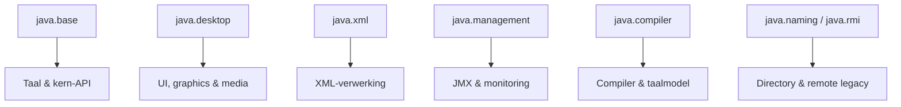
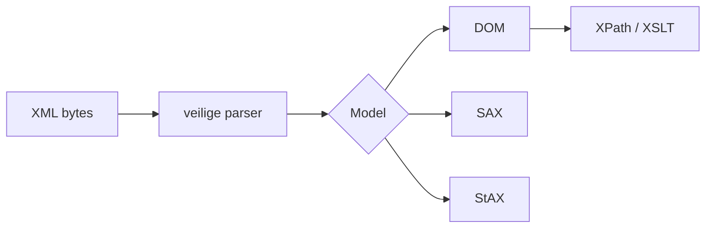
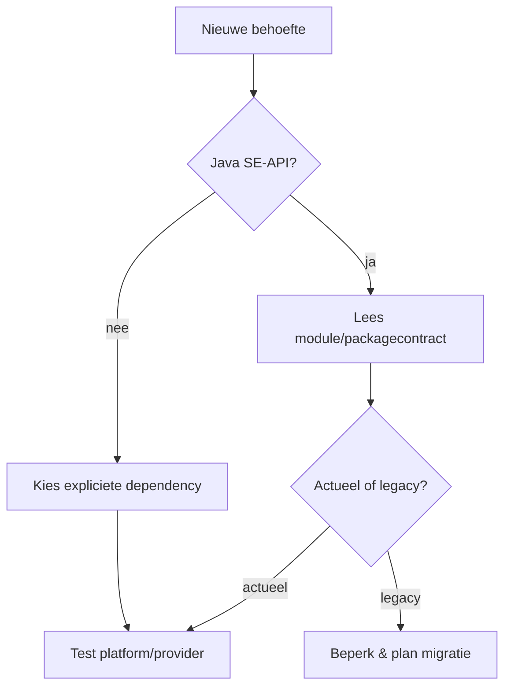

# 19 — Java SE-breedtekaart

[← Praktijk](../18-praktijk/README.md) ·
[Inhoudsopgave](../../INHOUDSOPGAVE.md) ·
[Dekkingsmatrix](../../DEKKING.md)

De eerdere modules behandelen de dagelijkse kern diep. Dit hoofdstuk voorkomt
blinde vlekken: het brengt de overige Java SE-gebieden in kaart, geeft hun
mentale model en laat zien wanneer je de officiële API-documentatie opent.

## Platformmodulekaart



Belangrijke modulefamilies:

| Module | Gebied |
|---|---|
| `java.base` | taalbasis, util, time, I/O, NIO, netwerk, security, streams |
| `java.net.http` | HTTP Client en WebSocket |
| `java.sql`, `java.transaction.xa` | JDBC en distributed-transactioncontracten |
| `java.xml`, `java.xml.crypto` | XML parsing, transformatie, validatie en XML-crypto |
| `java.desktop`, `java.datatransfer` | AWT/Swing, imaging, audio, print, clipboard |
| `java.management`, `java.management.rmi` | JMX en remote management |
| `java.naming` | JNDI naming/directory |
| `java.rmi` | Java Remote Method Invocation |
| `java.compiler` | compiler- en taalmodel-API |
| `java.instrument` | agents en class instrumentation |
| `java.logging` | `java.util.logging` |
| `java.prefs` | gebruikers-/systeemvoorkeuren |
| `java.scripting` | scripting-enginecontract; een engine is niet gegarandeerd meegeleverd |
| `java.security.jgss`, `java.security.sasl` | securityprotocol-API's |
| `java.smartcardio` | smartcards |

`java.se` is een aggregator die de gestandaardiseerde Java SE-modules transitief
vereist. JDK-specifieke modules (`jdk.*`) hebben niet automatisch hetzelfde
portable Java SE-contract.

## API-discovery

Begin bij de module, dan package, dan type, dan methode:

1. [Java SE 25 module overview][java-se];
2. module summary en service providers;
3. package summary voor concepten/constraints;
4. typecontract, `Since`, `Deprecated`, thread-safety en exceptions;
5. release notes en JEP bij versiegedrag.

Gebruik:

```bash
java --list-modules
jdeps --summary applicatie.jar
javap -p module-info.class
```

## AWT en Swing

`java.desktop` bevat AWT en Swing, plus graphics, imaging, audio, print,
accessibility en JavaBeans.

- **AWT** levert windowing, events, graphics en native-peercomponenten.
- **Swing** levert grotendeels lightweight widgets boven AWT.
- Layout managers berekenen componentposities; hardcoded pixels schalen slecht.
- Look-and-feel scheidt widgetweergave gedeeltelijk van gedrag.

### Event Dispatch Thread

Swingcomponenten worden vrijwel altijd op de Event Dispatch Thread (EDT)
gemaakt en gemuteerd:

```java
SwingUtilities.invokeLater(() -> {
    JFrame frame = new JFrame("Handboek");
    frame.setDefaultCloseOperation(WindowConstants.EXIT_ON_CLOSE);
    frame.add(new JLabel("Hallo, Java"));
    frame.pack();
    frame.setVisible(true);
});
```

Lang werk op de EDT bevriest de interface. Doe blocking/CPU-werk elders en
publiceer alleen het UI-resultaat terug op de EDT. `SwingWorker` biedt hiervoor
een klassiek contract; modern Java kan achtergrondwerk anders organiseren,
maar de EDT-grens blijft.

Test:

- businesslogica buiten widgets;
- eventhandlers als dunne adapters;
- accessibilitynamen en keyboardnavigatie;
- verschillende scaling/look-and-feels;
- headless versus echte windowomgeving.

## JavaFX

JavaFX is het moderne open-source desktop-ecosysteem met scene graph,
properties/bindings, CSS, controls, media en FXML. Het wordt afzonderlijk van
de JDK geleverd en heeft een JavaFX Application Thread.

Gebruik de [OpenJFX-handleiding][openjfx] voor de actuele JavaFX-versie,
Maven/Gradle-modules en runtime packaging. Vermeng geen Swing-EDT- en
JavaFX-threadregels; `SwingNode`/`JFXPanel`-integratie vereist beide modellen.

## Graphics, images, audio en print

| API | Gebruik |
|---|---|
| Java 2D (`Graphics2D`) | vormen, tekst, compositing, transforms |
| `BufferedImage`/`Raster` | in-memory pixels |
| `ImageIO` | image readers/writers en metadata |
| `javax.sound.sampled` | sampled audio capture/playback |
| `javax.sound.midi` | MIDI |
| Java Print Service | printers, attributes en printjobs |
| `java.awt.Desktop` | browser/mail/open/printintegratie indien ondersteund |

Risico's:

- onbetrouwbare mediabestanden en decompression bombs;
- grote pixelbuffers (`breedte × hoogte × bytes`);
- color profiles/metadata;
- platformcodec-/printerverschillen;
- headless servers;
- native resources/lifecycle.

Controleer capability (`Desktop.isDesktopSupported`, ondersteunde
ImageIO-formaten) in plaats van platformaanname.

## Clipboard, drag-and-drop en accessibility

`java.datatransfer` modelleert data flavors en transferables voor clipboard en
drag-and-drop. Externe clipboarddata is onbetrouwbare input.

Accessibility-API's beschrijven rollen, state en relaties voor assistive
technology. Een visueel werkende UI is niet automatisch keyboard- of
screenreaderbruikbaar.

## XML: vier leesmodellen

| Model | Geheugen | Gebruik |
|---|---:|---|
| DOM | hele boom | random toegang/wijziging, kleine documenten |
| SAX | push events | streaming, eenvoudige state machine |
| StAX | pull events | streaming met callercontrole |
| XPath | query over boom/context | selectie, niet volledige businessparser |



Andere JAXP-delen:

- `SchemaFactory`/`Validator` voor XSD;
- `TransformerFactory` voor XSLT;
- catalogs voor gecontroleerde resource-resolutie;
- `javax.xml.crypto` voor XML signatures/encryption wanneer het protocol dat
  werkelijk vereist.

### Veilige XML-grens

XML kan external entities, DTD's, imports en zeer diepe/grote structuren
bevatten. Voor onbetrouwbare input:

- zet secure processing en expliciete access properties;
- blokkeer externe DTD/schema/stylesheettoegang tenzij allowlisted;
- gebruik gecontroleerde resolver/catalog;
- stel grootte-, entity-, nesting- en tijdlimieten;
- valideer vóór domeinmapping;
- vertrouw niet op parserdefaults van een andere JDK/provider.

Gebruik de configuratie uit de `java.xml`-modulehandleiding van jouw
JDK-release; security properties evolueren.

## JMX en management

Java Management Extensions exposeert beheerde resources als MBeans:

```java
public interface WachtrijMXBean {
    int getGrootte();
    long getVerwerkt();
}
```

Een `MBeanServer` registreert objectnamen, attributes, operations en
notifications. MXBeans beperken waarden tot een portable mappingmodel.

Gebruik:

- runtime/configstatus inspecteren;
- begrensde beheeroperaties;
- JVM-platform-MXBeans;
- JConsole/JMC of monitoringbridge.

Remote JMX is een privileged beheerendpoint. Vereis authenticatie, TLS,
netwerkbeperking en minimale operations; publiceer geen secrets of onbegrensde
zware diagnose.

## Compiler- en taalmodel-API

`javax.tools.JavaCompiler` kan broncode programmatisch compileren:

```java
JavaCompiler compiler = ToolProvider.getSystemJavaCompiler();
if (compiler == null) {
    throw new IllegalStateException("Een JDK is vereist");
}
```

`javax.lang.model` en annotation processing modelleren declarations/types
tijdens compilatie. De Trees API en `jdk.compiler` zijn JDK-specifieker.

Onbetrouwbare code compileren is niet hetzelfde als veilig sandboxen. Moderne
Java heeft geen algemene Security Manager-sandbox; gebruik proces/container- of
VM-isolatie met resource- en netwerkgrenzen.

## Instrumentation, attach en diagnostics

- `java.instrument`: premain/agentmain en class transformers.
- Attach API (`jdk.attach`): lokale JVM benaderen waar toegestaan.
- JVM TI/JDWP: native tooling/debugprotocol.
- JDI: debuggerinterface.
- JFR/JMX: event- en managementobservability.

Dit zijn krachtige operationele grenzen. Beveilig artifactprovenance,
attachrechten, poorten en diagnostic output.

## JNDI

Java Naming and Directory Interface abstraheert naming/directoryservices zoals
LDAP. Object factories en remote references hebben historische
deserialisatie-/codebase-risico's.

Voor nieuw gebruik:

- beperk providers en URL-schemes;
- behandel namen/attributes als input;
- voorkom automatische objectmaterialisatie;
- gebruik TLS/authentication;
- sluit contexts;
- verkies een specifieke moderne client als generieke JNDI geen waarde toevoegt.

## RMI

RMI biedt remote calls tussen Java-objecten en gebruikt Java-serialisatie in
klassieke vormen. Het introduceert distributed-systemsfailure ondanks een
lokale methodeachtige API:

- partial failure en timeouts;
- versie-/serialisatiecontract;
- registry/networksecurity;
- retries en dubbele effecten;
- classloading/filtering.

Herken RMI voor legacy en JMX remote. Kies voor nieuwe publieke services vaak
een expliciet versioned protocol met veiliger dataformaat.

## JavaBeans en introspection

JavaBeans-conventies beschrijven properties, events en introspection.
`java.beans.Introspector` leidt property descriptors af uit methoden.
Dit leeft voort in desktoptools en frameworks.

Maak een conventie niet gelijk aan domeinencapsulatie: publieke setters voor
ieder veld zijn geen vereiste voor goed Java-ontwerp.

`java.beans.XMLEncoder/XMLDecoder` is geen universeel veilig of stabiel
extern serialisatieformaat.

## Preferences

`java.util.prefs.Preferences` bewaart kleine user-/systempreferences via een
platformprovider.

Niet geschikt als:

- database;
- secret store;
- grote configuratie;
- sterk transactioneel/portable bestand.

Keys/nodes hebben limieten en backinggedrag verschilt per platform.

## Scripting

`javax.script` definieert een enginecontract. Een moderne JDK hoeft geen
JavaScript-engine mee te leveren. Zoek engines via `ScriptEngineManager` en
declareer providerdependency expliciet.

Scriptcode is uitvoerbare code, geen onschuldige configuratie. Isoleer trust,
capabilities, tijd, geheugen en I/O buiten alleen de scripting-API.

## Resterende nichegebieden

| Gebied | API/module | Wanneer relevant |
|---|---|---|
| SASL/GSS-API | `java.security.sasl`, `java.security.jgss` | enterprise securityprotocol |
| smartcards | `java.smartcardio` | APDU/smartcardhardware |
| rowsets | `javax.sql.rowset` | disconnected JDBC-vormen |
| preferences | `java.prefs` | kleine desktopvoorkeuren |
| RMI-IIOP/CORBA | verwijderd uit moderne JDK | legacy-migratie |
| applets | verwijderd in Java 26 | historische migratie |
| Nashorn | niet meer meegeleverd | legacy-scriptmigratie |
| Security Manager | deprecated for removal/geen sandboxstrategie | legacy-policycode |

## Beslisboom



## Checklist

- [ ] Ik kan de belangrijkste Java SE-modules aan een probleemgebied koppelen.
- [ ] Ik ken EDT/JavaFX Application Thread en houd lang werk uit de UI-thread.
- [ ] Ik kies DOM, SAX of StAX op documentgrootte/toegang.
- [ ] XML-parsers en resolvers zijn begrensd tegen externe input.
- [ ] JMX/attach/instrumentation zijn beveiligde beheergrenzen.
- [ ] Ik herken JNDI/RMI/JavaBeans als context- en vaak legacygebonden.
- [ ] Ik controleer capability/provider/platform in plaats van aanwezigheid aan te nemen.
- [ ] Voor methode-details gebruik ik de juiste module/package-Javadoc.

## Primaire bronnen

- [Java SE 25 module overview][java-se]
- [`java.desktop` module][desktop]
- [`java.xml` module][xml]
- [OpenJFX Getting Started][openjfx]

[java-se]: https://docs.oracle.com/en/java/javase/25/docs/api/java.se/module-summary.html
[desktop]: https://docs.oracle.com/en/java/javase/25/docs/api/java.desktop/module-summary.html
[xml]: https://docs.oracle.com/en/java/javase/25/docs/api/java.xml/module-summary.html
[openjfx]: https://openjfx.io/openjfx-docs/
